# How to install WiFI 7 Adapter driver 
In this note I will show you how to install BE92 WiFi Driver from Realtek Chip. 

Note: 
In the market most often you saw Wifi7 usb dongle mention support TtialBrand (2.4G, 5G, and 6GHZ), MLO and etc. However realtech driver currently not support MLO Feature. 

If you want to use MLO, please use Intel chip like BE200 which will support all feature 6GHZ, and MLO. 

Most driver will only support window Driver as default, if you want to install Linux you can use my step. 

I have installed under HP Elitebook and work fine besides from MLO

##  <a id="toc"> Table to content </a>:

- [System Requirements](#SystemIInfo)
  - [Check Kernel Version](#Systemkernelver)
  - [check OS Version ](#os)
- [Verify USB Adapter Detection](#WifiAdapter) 
  -  [Check USB Device](#2.1)
  -  [Checking Kernel Logs](#2.2)
- [Install Driver](#3)
  - [Required Packages ](#3.1)
  - [Download Driver Source](#3.2)
  - [Build and Install Driver](#3.3)
  - [(Optional) Clean Previous Modules](#3.4)
  - [Uninstall Driver](#3.5)
- [Load and check module](#4)
- [Verify Driver Status](#5)
  - [Check Loaded Modules](#5.1)
  - [Check dmesg (Firmware and Errors)](#5.2)
  - [Verify Firmware Exists)](#5.3)
  - [Driver information](#5.4)
- [Check Interface](#6)
  - [Install wireless package](#6.1)
  - [List Interface](#6.2)
    - [show interfaces and link-layer state](#6.2_interface)
    - [show interface and ip address in readable format](#interfaceReadableFormat)
    - [show wireless interface](#6.2_showwirelessinterface)
      - iw
      - nmcli
    - [Change Wireless Interface](#6.3_changewirelessInterface)
- [WiFi Verification](#7)
  - [Scan SSID](#7.1)
    - [Method 1: nmcli (Recommended)](#7.1_nmcli)
    - [Method 2: iw (Low-level / Debug)](#7.1_iw)
  - [Rescan SSID](#7.2)
    - rescan and show all result
    - Rescan with specify field
  -[Connect SSID](#7.3) 
    - [Connect SSID](#7.3ConnectSSID)
    - [connect SSID with BSSID](#7.3ConnectBSSID)
  - [Check Status](#7.4) 
  - [Disable wireless(optional)](#7.5)
    - Force interface down (temporary)
    - Disable the Onboard Driver (Permanent & Clean)
  - [Connected SSID Profile (optional)](#7.6) 
    - [Show your SSID profile](#7.6_listprofilename)
  - [Check 6 GHz Support (iw only)](#7.7) 
    - [get regulatory domain](#7.7_setcountryCode)
	- [Check Support Wifi 7 Frequency](#7.7_WifiCheck7Freq_)
	- [Check whether it advertises Wi-Fi 7 features](#7.7_wifi7Feature)
    - [Scan SSID to see 6ghz](#7.7_band)
- [check Wireless Detail](#8)
	- check Wireless Detail 
	- monitor quality 

<a name="1. SystemIInfo"></a>
## 1. System Requirements [🔝](#toc)

<a name="Systemkernelver"></a>
### 1.1  Check Kernel Version [🔙](#SystemIInfo)

- Kernel must be >= 6.6
Check kernel must be at least kernel 6.6 or newer. This driver won't work on older kernels.

```
uname -r
#6.8.0-87-generic
```

<a name="os"></a>
### 1.2 check OS Version [🔙](#SystemIInfo)

```
cat /etc/*release
```

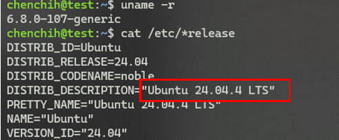

<a name="WifiAdapter"></a>
## 2. Verify USB Adapter Detection [🔝](#toc)

<a name="2.1"></a>
### 2.1 Check USB Device [🔙](#WifiAdapter)

Use `lsusb` to list connected USB devices.

```
lsusb
```

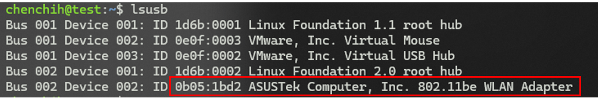

<a name="2.2"></a>
### 2.2 Checking Kernel Logs [🔙](#WifiAdapter)

Check dmesg logs for USB connection events:
```
dmesg | grep -i usb
```
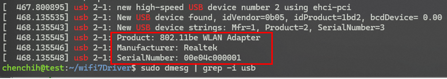

you cn also filter the driver name
```
sudo dmesg | grep -i rtw89 | tail -n 10
```

<a name="3"></a>
## 3. Install Driver [🔝](#toc)

- [Required Packages ](#3.1)
- [Download Driver Source](#3.2)
- [Build and Install Driver](#3.3)
- [(Optional) Clean Previous Modules](#3.4)
- [Uninstall Driver](#3.5)

<a name="3.1"></a>
### 3.1 Required Packages [🔙](#3)

```
sudo apt update
sudo apt install -y build-essential git dkms linux-headers-$(uname -r)
sudo apt install -y iw
```

<a name="3.2"></a>
### 3.2 Download Driver Source [🔙](#3)
Clone  BE92 Driver Repository, Most BE92 USB adapters use:
Realtek RTL8922AU / RTL8852BU / RTL8832CU (WiFi 6/7 family)
```
git clone https://github.com/morrownr/rtw89.git
cd rtw89
```

<a name="3.3"></a>
### 3.3 Build and Install Driver [🔙](#3)

```
sudo make
sudo make install
```

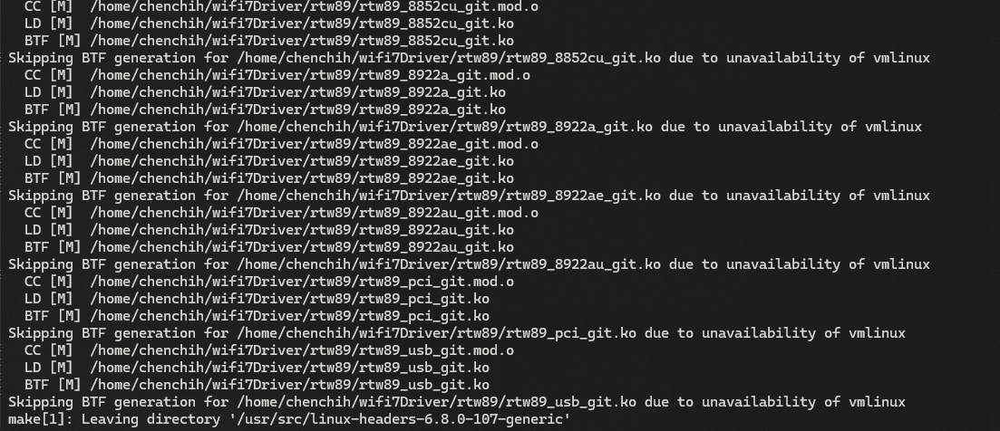

> **Note**:Error msg can skip:
>> - `CC` = compiling source files 
>> - `LD` = linking module files 
>> - `.ko` = built kernel modules 
>> - `Skipping BTF generation` = warning/informational, usually safe to ignore

<a name="3.4"></a>
### 3.4 (Optional) Clean Previous Modules [🔙](#3)

If you have any existing rtw89 modules (from other attempts or older installations), clean them out:
```
sudo make cleanup_target_system
```

<a name="3.5"></a>
### 3.5 Uninstall Driver [🔙](#3)

- Check the version of the rtw89 driver installed in your system.

```
sudo dkms status rtw89
```

- Remove the rtw89 driver and its source code (Change the driver version accordingly)

```
sudo dkms remove rtw89/6.15 --all
```

- For users who installed the driver via `make`, run these commands in the rtw89 source directory
```
sudo make uninstall
sudo rm -f /etc/modprobe.d/rtw89.conf
```

<a name="4"></a>
## 4. Load and check module [🔝](#toc) 

```
sudo depmod -a
sudo modprobe rtw89_core_git
sudo modprobe rtw89_8922au_git
```

<a name="5"></a>
## 5. Verify Driver Status [🔝](#toc)

- [Check Loaded Modules](#5.1)
- [Check dmesg (Firmware and Errors)](#5.2)
- [Verify Firmware Exists)](#5.3)
- [Driver information](#5.4)
  
<a name="5.1"></a>
### 5.1 Check Loaded Modules [🔙](#5)
```
lsmod |grep rtw89
```

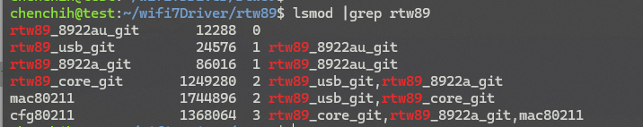

<a name="5.2"></a>
### 5.2 Check dmesg (Firmware / Errors) [🔙](#5)
```
sudo dmesg | grep rtw89
```

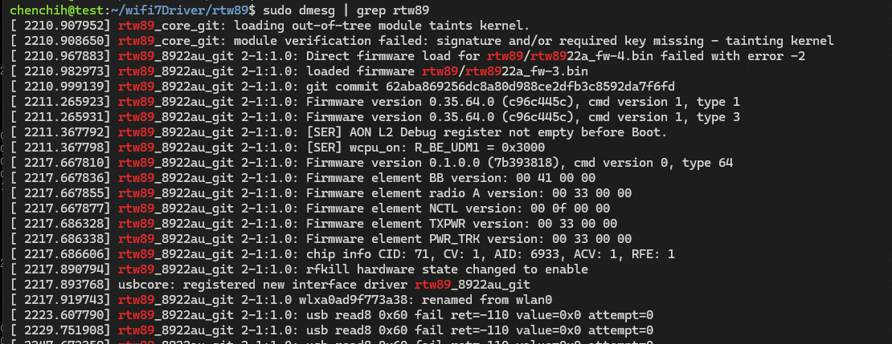

<a name="5.3"></a>
### 5.3 Verify Firmware Exists [🔙](#5)
```
ls /lib/firmware/rtw89/
```


<a name="5.4"></a>
### 5.4 Driver information [🔙](#5)

- Check driver infor

```
ethtool -i <wlaninterfacex>
```
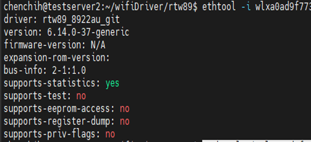


- Model, driver, ID vendor

```
udevadm info -q property -p /sys/class/net/<wlaninterfaceX> | grep -E 'ID_BUS|ID_VENDOR_ID|ID_MODEL_ID|ID_MODEL|DRIVER'
```
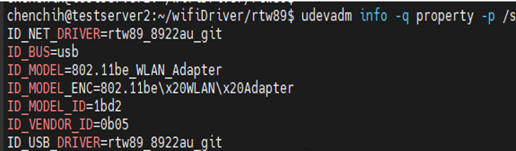

<a name="6"></a>
## 6. Check Interface [🔝](#toc) 

- [Install wireless package](#6.1)
- [List Interface](#6.2)
  - [show interfaces and link-layer state](#6.2_interface)
  - [show interface and ip address in readable format](#interfaceReadableFormat)
  - [show wireless interface](#6.2_showwirelessinterface)
    - iw
    - nmcli
  - [Change Wireless Interface](#6.3_changewirelessInterface)
	
<a name="6.1"></a>
### 6.1 Install wireless package (if needed ) [🔙](#6)

Please install `iw` or `nmcli`  package in order to use this tool.

```
sudo apt install -y iw
sudo apt install -y network-manager
```
<a name="6.2"></a>
### 6.2 List Interface  [🔙](#6)

<a name="6.2_interface"></a>
#### show interfaces and link-layer state [🔙](#6)

```
ip link show
```

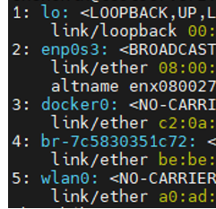

<a name="6.2_interfaceReadableFormat"></a>
#### show interface and ip address in readable format [🔙](#6)
This is pretty useful to see IP address neater way instead of showing unrealted information. 

```
ip -br a
```

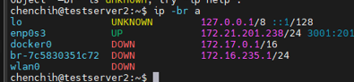

<a name="6.2_showwirelessinterface"></a>
#### show wireless interface [🔙](#6)

There are two command which are able to check wifi interface and detail information: `iw` and `nmcli`


- > `iw`:
This command allow to check your wireless phy or HW information. If you have multiply wireless interface then it will show `phy#0` .. `phy#1`. This command is useful which allow to check Wireless Infromation. 

```
iw dev
```

-  > `nmcli`

This command will be use often when you want to check whether WiFi is connected
```
nmcli device status
```

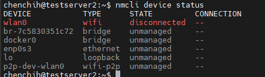

<a name="6.3_changewirelessInterface"></a>
### 6.3 Change Wireless Interface (optional) [🔙](#6)

Default Wireless adapter interface often named format as `wl<macaddress>`. You are able to change your wireless interface name, which either you don't want to display your mac address or wants a shorter interface name like `wlan0` , or `xxx0`. Below are the step to change wireless interface name.


- Step 1. Create `10-asus-usbwifi.link`

Please create the filename on this path
```
nano /etc/systemd/network/10-asus-usbwifi.link
```

- Step 2. edit the file and add below content

Get your wireless mac address using the command I mention or `ip a` command, then add mac address into the file you created just now 

modify the file:
```
nano /etc/systemd/network/10-asus-usbwifi.link
```

copy below conent into file name , and wireless mac address and interface name

```
[Match]
MACAddress=<Wireless Mac address XX:XX:XX:XX:XX:XX>

[Link]
Name=<interfaceName>
NamePolicy=
```

- Step 3. reboot your system 

```
reboot 
```

<a name="7"></a>
## 7. WiFi Verification [🔝](#toc)

In this section I will show how to use wireless command including how to scan, connect, check wireless information, and etc. 

- [Scan SSID](#7.1)
  - [Method 1: nmcli (Recommended)](#7.1_nmcli)
  - [Method 2: iw (Low-level / Debug)](#7.1_iw)
- [Rescan SSID](#7.2)
  - rescan and show all result
  - Rescan with specify field
-[Connect SSID](#7.3) 
  - [Connect SSID](#7.3ConnectSSID)
  - [connect SSID with BSSID](#7.3ConnectBSSID)
- [Check Status](#7.4) 
- [Disable wireless(optional)](#7.5)
  - Force interface down (temporary)
  - Disable the Onboard Driver (Permanent & Clean)
- [Connected SSID Profile (optional)](#7.6) 
  - [Show your SSID profile](#7.6_listprofilename)
- [Check 6 GHz Support (iw only)](#7.7) 
  - [get regulatory domain](#7.7_setcountryCode)
 [Check Support Wifi 7 Frequency](#7.7_WifiCheck7Freq_)
 [Check whether it advertises Wi-Fi 7 features](#7.7_wifi7Feature)
  - [Scan SSID to see 6ghz](#7.7_band)


The flow of the wireless will book like this:

> - Step 1: Disconnect the current SSID

```
sudo nmcli device disconnect asus0
```

> - Step 2: Scan for the new SSID

```
sudo nmcli dev wifi rescan ifname asus0
```

> - Step 3: Connect to the new SSID

```
sudo nmcli dev wifi connect "NEW_SSID" password "PASSWORD" ifname asus0
```


<a name="7.1"></a>
### 7.1 Scan SSID [🔙](#7)

We can use these two method:
- Use`nmcli` for quick checks: this is easier to use, you can get result faster
- Use `iw` for debugging: this is complicated when you scan will list many information, need to filter. 

<a name="7.1_nmcli"></a>
#### Method 1: nmcli (Recommended) [🔙](#7)

- Scan using default interface

```
nmcli dev wifi list
```

- explicit wlan interface to scan (if multiply wlan interface)
If you have multiply wireless interface, you have to explicit your interface else it will use default. A better approah is to disable the wireless interface, and left with only one interface. 
```
nmcli device wifi list ifname <Wireless interfac>
```

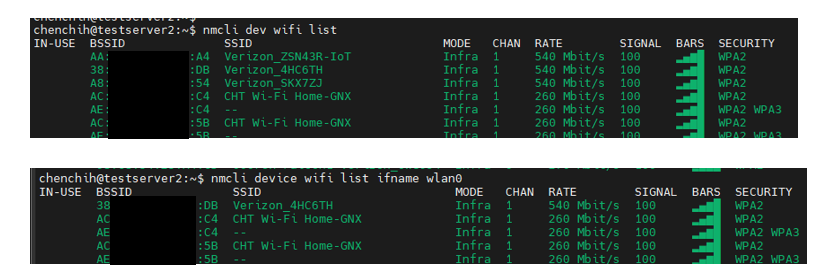

- Filter option
you can use `grep` to filter specfic SSID, and use  `-i` option to ignore case senstive

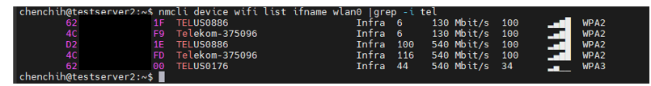

- Scan with specifc field option

> sntax: `mcli -f [Field Name] device wifi list [Wireless Interface Name]`

```
# list all SSID and specify wireless interface
nmcli -f BSSID,SSID,FREQ,CHAN,RATE,SIGNAL,SECURITY device wifi list ifname <wireless Interface name>

# filter ssid 
nmcli -f BSSID,SSID,CHAN,SIGNAL,SECURITY device wifi list |grep SSID
```

<a name="7.1_iw"></a>
#### Method 2: iw (Low-level / Debug) [🔙](#7)

You can also use iw command, which is a low level command which  will show more detail information releated to Wireless interface or SSID information like frequency, signal, ssid, and etc. This command often use to check HW realted information which I will conver in below section on how to check 6GHZ. 

- Scan SSID with iw command
```
sudo iw dev  <interfaceName>  scan | grep -E "SSID|freq:|channel" | grep -A 2 "<SSIDName>"
```
This will list every frequency where SSID is detected.

- Check connected SSID
```
iw dev <Wireless interface name> link
```

- Filter all SSID with advance command

Scan all ssid 
```
sudo iw dev wlan0 scan | awk '
/SSID:/ {
  ssid=substr($0, index($0,$2))
  print "SSID: " ssid
}'
```


Scan All SSID with specfic field

```
sudo iw dev <interfaceName> scan | awk '
/^BSS/ {bssid=$2}
/freq:/ {freq=$2}
/signal:/ {signal=$2 " " $3}
/SSID:/ {
  ssid=substr($0, index($0,$2))
  print "SSID: " ssid " | BSSID: " bssid " | FREQ: " freq " MHz | SIGNAL: " signal
}'
```

Show connected SSID with specfic field

```
iw dev <wireless interface name> link | awk '
/SSID:/ {ssid=$2}
/freq:/ {freq=$2}
/signal:/ {signal=$2 " " $3}
/rx bitrate:/ {rx=$3 " " $4 " " $5}
/tx bitrate:/ {tx=$3 " " $4 " " $5}
END {
  print "SSID: " ssid " | FREQ: " freq " MHz | SIGNAL: " signal " | RX: " rx " | TX: " tx
}'
```

<a name="7.2"></a>
### 7.2 Rescan SSID [🔙](#7)
without `rescan` it uses cached results only, which mean the ssid result are all old

- rescan and show all result

```
nmcli dev wifi list --rescan yes
```
`--rescan auto`: default behavior

- rescan silent : force new scan (will not display scan result)
```
sudo nmcli dev wifi rescan ifname <wireless interface Name>
```

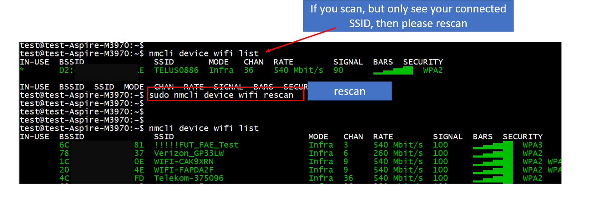

- Rescan with specify field
```
sudo nmcli --fields SSID,BSSID,CHAN,FREQ,SIGNAL,SECURITY dev wifi list --rescan yes | grep -i <SSID>
```
or 
```
sudo nmcli -f SSID,BSSID,CHAN,FREQ,SIGNAL dev wifi list ifname <wireless interface name>
```

<a name="7.3"></a>
### 7.3 Connect SSID [🔙](#7)

<a name="7.3ConnectSSID"></a>
#### Connect SSID [🔙](#7)

> Syntax: `nmcli dev wifi connect "YOUR_WIFI_NAME" password "YOUR_PASSWORD"`

```
example: `nmcli device wifi connect "SSID1" password "1234567890"
```
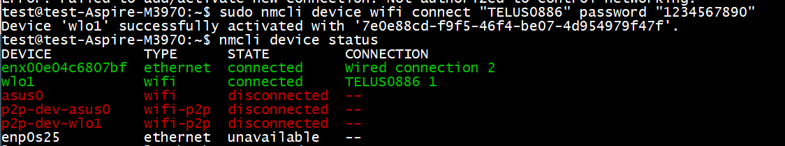

you can also use `ask` option for asking password

```
sudo nmcli device wifi connect SSIDNAME --ask
```

<a name="7.3ConnectBSSID"></a>
#### connect SSID with BSSID [🔙](#7)

```
sudo nmcli dev wifi connect XX:XX:XX:XX:XX:XX password "12345678" ifname <interface name>
```

<a name="7.4"></a>
### 7.4 Check Status [🔙](#7)
Now let make a full summary and flow on how we connected, disconnected and check status to see it connected

```
#show all interface link status
nmcli device status
```

<a name="7.5"></a>
### 7.5 Disable wireless(optional) [🔙](#7)

If you have multiply interface and not knowing which one it used, you can disable the onboard wireless interface. There're many different method you can disable or turn off wireless interface:


#### Method1: Force interface down (temporary)

This method will only temporary work, if you rebot it will restore back

```
#disconnect SSID
nmcli device disconnect <wlan1 interface>

# shitdown your wireless interface
sudo ip link set  <wlan1 interface>  down
sudo nmcli device set <wlan interface> managed no
sudo nmcli device connect  <wlan2 interface>
```

#### Method2: Disable the Onboard Driver (Permanent & Clean)
This will take effect after reboot

1.	Find the driver name for the onboard card:
```
lspci -nnk | grep -i network -A 3
```

2. Add driver name into Blacklist

Replace `<driver_name>` with what you found above (e.g., iwlwifi)

```
echo "blacklist <driver_name>" | sudo tee /etc/modprobe.d/blacklist-onboard-wifi.conf
```

3. Apply and reboot

```
sudo update-initramfs -u
sudo reboot
```

4. Recover back to onboard

```
sudo rm /etc/modprobe.d/disable-onboard.conf
sudo update-initramfs -u
sudo reboot
```


<a name="7.6"></a>
### 7.6 Connected SSID Profile (optional) [🔙](#7)

When you connected SSID actually it's save into profile configure file, which recorded SSID, PSK, and many more SSID information. You can alos use the profile to connected rather than above method. 

> Path location : `ls /etc/NetworkManager/system-connections`

<a name="7.6_listprofilename"></a>
#### Show your SSID profile  [🔙](#7)

This will only exist if you ever make a connection

```
nmcli connection show
```

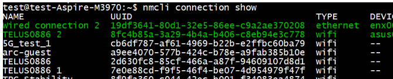

or 

```
sudo nmcli connection show "<Profile Name>"
```

If your see duplicate prifile like guest or guest 1, just do like this

```
# single profile
nmcli connection show "gues1"

# duplicate profile
nmcli connection show "guest 1"
```


<a name="7.6_connectedProfile"></a>
#### Connected via profile [🔙](#7)

When you connect it will generate the profile, no matter success or not it record all the information on the profile configure. 

- Connect with Name

```
sudo nmcli connection up "<name>"
```

- Connected with specify interface
```
sudo nmcli connection up "TELUS0886" ifname asus0
```

<a name="7.6_ReadProfileContent"></a>
#### Read Profile content [🔙](#7)
This allow yto read your profile content

- Read PSK
```
sudo nmcli connection show ""<Profile Name>" --show-secrets | grep psk
```

- Show profile content
```
nmcli connection show "SSID-guest 1"
```


- Read multiply field
```
nmcli -f connection.id,connection.type,connection.interface-name,802-11-wireless.ssid connection show "<profile Name>"
```

<a name="7.6_ProfielModify"></a>
#### Modify the profile [🔙](#7)

- Adding psk
```
sudo nmcli connection modify "SSID-guest" wifi-sec.psk "00000000"
```

- Enable Auto connection 
```
sudo nmcli connection modify "TELUS0886" connection.autoconnect yes
```

- Clear Profile
```
#clear it
sudo nmcli connection modify "guest" connection.interface-name ""
#connect it
sudo nmcli connection up "guest" ifname wlan0
```

<a name="7.6_Profieldelete"></a>
####  delete profile [🔙](#7)
If you change SSID PSK, then the profile needed to clear or delete it. To regenerate it, just spimply use the connect command, no matter success conencted or not it will generate it

```
sudo nmcli connection delete "guest"
```

<a name="7.7"></a>
### 7.7 Check 6 GHz Support (iw only) [🔙](#7)

In this part will use the low level wireless command `iw` to see more detail of Wireless HW information

<a name="7.7_setcountryCode"></a>
#### get regulatory domain [🔙](#7)

If you first time use the adapter please check regulatory domain, usullay it set to default, you need to set esle wifi7 6ghz might not work. 

```
iw reg get
#filter 6Ghz frequency
iw list | grep -Ei '6 GHz|5955|5975|6115|6435|6875|7115'
```

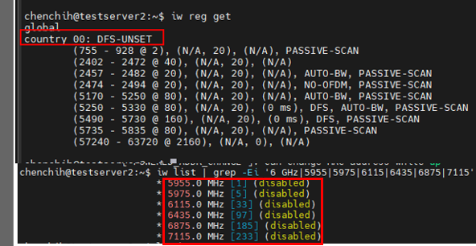

In Linux, cfg80211 starts with a highly restrictive world regulatory domain(country 00: DFS-UNSET). If it shows `00`, that is the generic world domain, and 6 GHz often stays unavailable there because Linux begins with restrictive defaults. 

You need to enable it according to which country you're. Each country might support different frequency, so you have to set correct region. 

you can also use the phy to check (`iw dev`) supoort 6GHz
```
iw phy phy4 info | grep -Ei '6 GHz|5955|6115|6435'
```

Notice 6ghz frequency are disable or not working 

- enable country code to enable 6Ghz
Let set correct country code and see if it can show 6ghz support 

> set country syntax: `sudo iw reg set <country ex: US, JP, TW..>`

```
sudo iw reg set TW
iw reg get
```

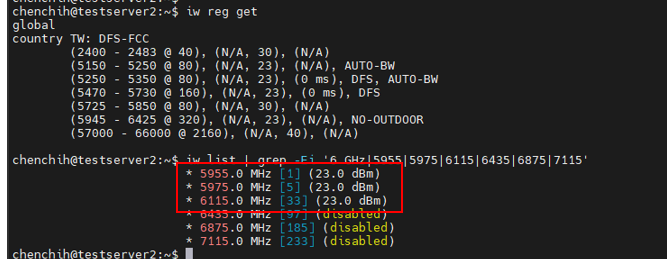

After set country code, you can see it can detect some 6ghz frequency

<a name="7.7_WifiCheck7Freq_"></a>
#### Check Support Wifi 7 Frequency  [🔙](#7)
 
- 6GHz

```
iw list | grep -Ei '6 GHz|5955|5975|6115|6435|6875|7115'
```

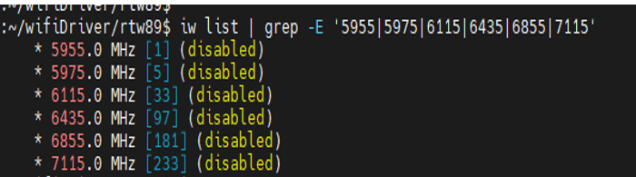

- 2.4G and 5G
  
```
iw list | grep -Ei '2412|2462|5180|5500|5825'
```

Below is how to detemine which Frequency are 2.4G, 5G and 6GHz

> 2.4 GHz support: frequencies like `2412, 2437, 2462` 
> 5 GHz support: frequencies like `5180, 5200, 5745, 5805 `
> 6 GHz support: frequencies like `5955` and above

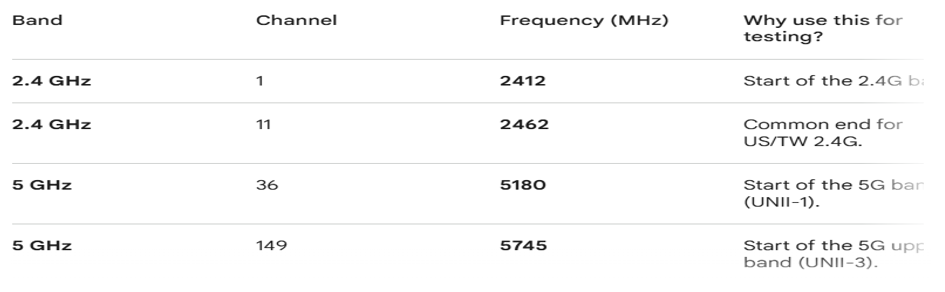

<a name="7.7_wifi7Feature"></a>
#### Check whether it advertises Wi-Fi 7 features [🔙](#7)

```
iw list | grep -A 20 -E 'EHT|HE|VHT'
```
> VHT = Wi-Fi 5 
> HE = Wi-Fi 6 / 6E (802.11ax = Wi-Fi 6 / 6E capability)
> EHT = Wi-Fi 7 (802.11be = Wi-Fi 7 capability)

<a name="7.7_band"></a>
#### Scan SSID to see 6ghz [🔙](#7)
You can scan SSID if DUT support triBand it will show all three band 2.4G, 5G, and 6Ghz, also 6Ghz band security as WPA3

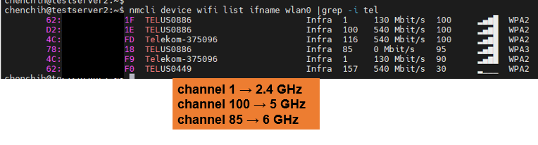

- reload wireless 
Wi-Fi card is often still running on its old "World Domain" (00) settings. To force the driver to reload the new limits, you should toggle the Wi-Fi off and on:

```
sudo nmcli radio wifi off
sudo nmcli radio wifi on
```

<a name="8"></a>
### 8. check Wireless Detail [🔝](#toc) 

- Get info about WLAN connections (data rate, SSID, channel (MHz), signal strength, etc.)
```
sudo iw wlan0 info
```

- monitor quality 

- Get info about WLAN link quality
```
cat /proc/net/wireless
```

- update it every seconds like this:
```
watch -n 1 cat /proc/net/wireless
```

## Reference
- https://www.itdojo.com/courses-linux/linuxwifi/
- https://blog.alpaca.tw/posts/wifi-connect-with-command/