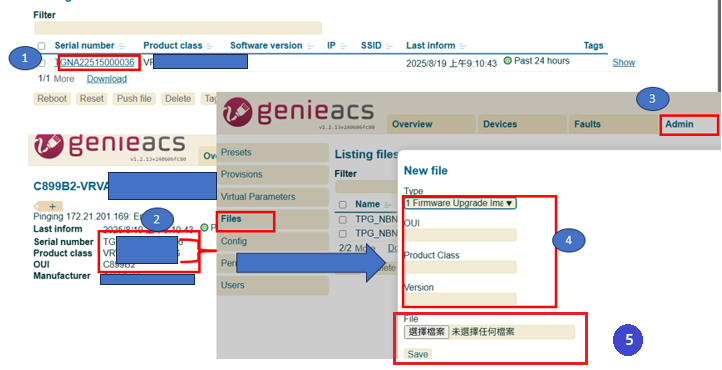

# Setup GenieACS (opensource)

This is a tutorial on how to set up Genieacs server under Ubuntu. Below are the steps you can set up manually. 


**Note:**  `Ubuntu 20.04` and `24.04` setups are different. There are many resources to teach you Ubuntu 20.04, however, I will also write how to setup under 20.04 in case you want to see the comparison. 
- Ubuntu 20.04: SSL uses 1.1.1 and MongoDB use 4.4
- Ubuntu 22.04 ~25.04: SSL uses 3.X and MongoDB use 8.0

## Automation
I also provide an automation that will allow for automatic installation and setup. The script supports both `libssl1.1` and `libssl3.3`. 
- script name: `genie_acs_new.sh`
- how to run: `./genie_acs_new.sh`

## Content
- [Check PI Model/OS ver](#systemcheck) 
- [Ubuntu 20.04](#ubuntu20)
- [Ubuntu 22.04 ~ 25.04:](#ubuntu24)
- [Run GenieACS](#RunGenieACS)
- [CPE Set Acs server](cperegister)

##  <a id="systemcheck"> Raspeberry PI5 setting check OS </a> [🔝](#Content)
Let me show some of the OS information and PI5 settings

### check OS version
```
lsb_release -a
```


### check kernel 
You can use either of these commands: 
> `uname -ar` or
> `hostnamectl`

### check CPU type

This is important if you want to install a specfic package, you need to know its ARM CPU 
```
lscpu
```


### check Raspberry Model and type
You can use either one to check the model:

> - `cat /proc/device-tree/model`
> - `cat /proc/cpuinfo | grep 'Model'`


## <a id="ubuntu24"> Ubuntu 24.04 Setup </a> [🔝](#Content)

Check your OS version using these commands: 
> - `lsb_release -a`
> - `cat /etc/*release`

### Step1: Install node.js

```
curl -sL https://deb.nodesource.com/setup_14.x -o nodesource_setup.sh
sudo bash nodesource_setup.sh
sudo apt install nodejs
node -v
```
### Step2: Install MongoDB
Skip installing SSL, different ubuntu version have differnt SSL version:
- Ubuntu 20.04  use ssl v1.1 
- ubuntu 22.04 or above uses  `ssl v3`, you can check by this command `dpkg -l | grep libssl3`

you can check full version with this command: `openssl version ` or `SSL_VERSION=$(openssl version | awk '{print $2}')`


#### 2.1 MogoDB GPG Key
```
#update
sudo apt update 
#install curl
sudo apt install gnupg curl -y 
#use curl to download MongoDB
curl -fsSL https://www.mongodb.org/static/pgp/server-8.0.asc | \ sudo gpg -o /usr/share/keyrings/mongodb-server-8.0.gpg \ --dearmor
```
#### 2.2 Mongodb installation

```
#add the url into sources.list
echo "deb [ arch=amd64,arm64 signed-by=/usr/share/keyrings/mongodb-server-8.0.gpg ] https://repo.mongodb.org/apt/ubuntu jammy/mongodb-org/8.0 multiverse" | sudo tee /etc/apt/sources.list.d/mongodb-org-8.0.list
#update 
sudo apt update
```
- install mogodb
```
# Install MongoDB
sudo apt install -y mongodb-org
```

- start mongod services
```
# Start and Enable the MongoDB Service
sudo systemctl start mongod 
sudo systemctl enable mongod 
sudo systemctl status mongod
```

### Step3: Install GenieACS
```
sudo apt update
sudo apt install nodejs npm

sudo npm install -g genieacs@1.2.13
sudo useradd --system --no-create-home --user-group genieacs

mkdir /opt/genieacs
mkdir /opt/genieacs/ext
chown genieacs:genieacs /opt/genieacs/ext
```

### Step4: Configure GenieACS
You can refer to this [GenieACS](#http://docs.genieacs.com/en/latest/installation-guide.html#install-genieacs)

#### edit genieacs.env
> `vi /opt/genieacs/genieacs.env` 
```
GENIEACS_CWMP_ACCESS_LOG_FILE=/var/log/genieacs/genieacs-cwmp-access.log
GENIEACS_NBI_ACCESS_LOG_FILE=/var/log/genieacs/genieacs-nbi-access.log
GENIEACS_FS_ACCESS_LOG_FILE=/var/log/genieacs/genieacs-fs-access.log
GENIEACS_UI_ACCESS_LOG_FILE=/var/log/genieacs/genieacs-ui-access.log
GENIEACS_DEBUG_FILE=/var/log/genieacs/genieacs-debug.yaml
NODE_OPTIONS=--enable-source-maps
GENIEACS_EXT_DIR=/opt/genieacs/ext
```

- Set file ownership and permissions:
```
sudo chown genieacs:genieacs /opt/genieacs/genieacs.env
sudo chmod 600 /opt/genieacs/genieacs.env
```

#### add jwt secret
Add `jwt secret`, if not, an error will occur, like the picture below: 
```
node -e "console.log(\"GENIEACS_UI_JWT_SECRET=\" + require('crypto').randomBytes(128).toString('hex'))" >> /opt/genieacs/genieacs.env
```


#### Create logs directory
```
mkdir /var/log/genieacs
chown genieacs:genieacs /var/log/genieacs
```
#### Create genieacs-cwmp systemd unit files

Note: if you want to check the full path use `which genieacs-cwmp`

> `sudo systemctl edit --force --full genieacs-cwmp`
```
[Unit]
Description=GenieACS CWMP
After=network.target

[Service]
User=genieacs
EnvironmentFile=/opt/genieacs/genieacs.env
ExecStart=/usr/local/bin/genieacs-cwmp
[Install]
WantedBy=default.target
```

#### Create genieacs-nbi systemd unit files

Note: if you want to check the full path use `which genieacs-nbi`

> `sudo systemctl edit --force --full genieacs-cwmp`
```
[Unit]
Description=GenieACS NBI
After=network.target

[Service]
User=genieacs
EnvironmentFile=/opt/genieacs/genieacs.env
ExecStart=/usr/local/bin/genieacs-nbi

[Install]
WantedBy=default.target
```

#### Create genieacs-fs systemd unit files

Note: if you want to check the full path use `which genieacs-fs`

```
[Unit]
Description=GenieACS FS
After=network.target

[Service]
User=genieacs
EnvironmentFile=/opt/genieacs/genieacs.env
ExecStart =/usr/local/bin/genieacs-fs

[Install]
WantedBy=default.target

```
#### Create genieacs-ui systemd unit files

Note: if you want to check the full path use `which genieacs-ui`

> `sudo systemctl edit --force --full genieacs-ui`
```
[Unit]
Description=GenieACS UI
After=network.target

[Service]
User=genieacs
EnvironmentFile=/opt/genieacs/genieacs.env
ExecStart=/usr/local/bin/genieacs-ui 

[Install]
WantedBy=default.target
```

#### Create logroate
> `nano /etc/logrotate.d/genieacs`

```
/var/log/genieacs/*.log /var/log/genieacs/*.yaml {
    daily
    rotate 30
    compress
    delaycompress
    dateext
}
```

### Enable and start services 
```
sudo systemctl enable genieacs-cwmp
sudo systemctl start genieacs-cwmp
sudo systemctl status genieacs-cwmp

sudo systemctl enable genieacs-nbi
sudo systemctl start genieacs-nbi
sudo systemctl status genieacs-nbi

sudo systemctl enable genieacs-fs
sudo systemctl start genieacs-fs
sudo systemctl status genieacs-fs

sudo systemctl enable genieacs-ui
sudo systemctl start genieacs-ui
sudo systemctl status genieacs-ui
```

It should be able to access Genie ACS if nothing is wrong, navigate web: http://<IP>:3000
You can use `ip a` or `hostname -I` to check your IP address

## <a id="ubuntu20"> Ubuntu 20.04 Setup</a> [🔝](#Content)
Please run this command to allow running multiple processes. In case you execute the command run `waiting for cache lock`, this issue:
```
sudo rm /var/lib/dpkg/lock-frontend
sudo rm /var/lib/dpkg/lock
sudo rm /var/cache/apt/archives/lock
sudo dpkg --configure -a
sudo apt update

```
### Step1: Install node.js
```
curl -sL https://deb.nodesource.com/setup_14.x -o nodesource_setup.sh
sudo bash nodesource_setup.sh
sudo apt install nodejs
node -v
```
### Step2: Install MongoDB

#### download libssl (SKIP no need)
```
echo "deb http://security.ubuntu.com/ubuntu impish-security main" | sudo tee /etc/apt/sources.list.d/impish-security.list
sudo apt-get update
```
#### install mogodb
```
sudo apt update
sudo apt install mongodb-org
sudo systemctl start mongod.service
sudo systemctl status mongod
sudo systemctl enable mongod
mongo --eval 'db.runCommand({ connectionStatus: 1 })'
```

### Step3: Install GenieACS

Same as 24.04
```
sudo apt update
sudo apt install nodejs npm

sudo npm install -g genieacs@1.2.13
sudo useradd --system --no-create-home --user-group genieacs

mkdir /opt/genieacs
mkdir /opt/genieacs/ext
chown genieacs:genieacs /opt/genieacs/ext

```

### Step4: Configure GenieACS
You can refer to this [GenieACS](#http://docs.genieacs.com/en/latest/installation-guide.html#install-genieacs)

#### edit genieacs.env
> `vi /opt/genieacs/genieacs.env` 
```
GENIEACS_CWMP_ACCESS_LOG_FILE=/var/log/genieacs/genieacs-cwmp-access.log
GENIEACS_NBI_ACCESS_LOG_FILE=/var/log/genieacs/genieacs-nbi-access.log
GENIEACS_FS_ACCESS_LOG_FILE=/var/log/genieacs/genieacs-fs-access.log
GENIEACS_UI_ACCESS_LOG_FILE=/var/log/genieacs/genieacs-ui-access.log
GENIEACS_DEBUG_FILE=/var/log/genieacs/genieacs-debug.yaml
NODE_OPTIONS=--enable-source-maps
GENIEACS_EXT_DIR=/opt/genieacs/ext
```

#### Set file ownership and permissions:
```
sudo chown genieacs:genieacs /opt/genieacs/genieacs.env
sudo chmod 600 /opt/genieacs/genieacs.env
```

#### add  jwt secret
```
node -e "console.log(\"GENIEACS_UI_JWT_SECRET=\" + require('crypto').randomBytes(128).toString('hex'))" >> /opt/genieacs/genieacs.env
```


#### Create logs directory
```
mkdir /var/log/genieacs
chown genieacs:genieacs /var/log/genieacs
```
#### Create genieacs-cwmp systemd unit files

Note: if you want to check the full path use `which genieacs-cwmp`

> `sudo systemctl edit --force --full genieacs-cwmp`
```
[Unit]
Description=GenieACS CWMP
After=network.target

[Service]
User=genieacs
EnvironmentFile=/opt/genieacs/genieacs.env
#ExecStart=/usr/bin/genieacs-cwmp
ExecStart=/usr/bin/genieacs-cwmp
[Install]
WantedBy=default.target
```

#### Create genieacs-nbi systemd unit files

Note: if you want to check the full path use `which genieacs-nbi`

> `sudo systemctl edit --force --full genieacs-cwmp`
```
[Unit]
Description=GenieACS NBI
After=network.target

[Service]
User=genieacs
EnvironmentFile=/opt/genieacs/genieacs.env
#ExecStart=/usr/bin/genieacs-nbi
ExecStart=/usr/bin/genieacs-nbi
[Install]
WantedBy=default.target

```

#### Create genieacs-fs systemd unit files

Note: if you want to check the full path use `which genieacs-fs`

```
[Unit]
Description=GenieACS FS
After=network.target

[Service]
User=genieacs
EnvironmentFile=/opt/genieacs/genieacs.env
#ExecStart=/usr/bin/genieacs-fs
ExecStart=/usr/bin/genieacs-fs
[Install]
WantedBy=default.target

```
#### Create genieacs-ui systemd unit files

Note: if you want to check the full path use `which genieacs-ui`

> `sudo systemctl edit --force --full genieacs-ui`
```
[Unit]
Description=GenieACS UI
After=network.target

[Service]
User=genieacs
EnvironmentFile=/opt/genieacs/genieacs.env
#ExecStart=/usr/bin/genieacs-ui
ExecStart=/usr/bin/genieacs-ui
[Install]
WantedBy=default.target
```

#### Create logroate
> `nano /etc/logrotate.d/genieacs`

```
/var/log/genieacs/*.log /var/log/genieacs/*.yaml {
    daily
    rotate 30
    compress
    delaycompress
    dateext
}

```

## <a id="RunGenieACS">Run GenieACS</a>

### Enable and start services 
```
sudo systemctl enable genieacs-cwmp
sudo systemctl start genieacs-cwmp
sudo systemctl status genieacs-cwmp

sudo systemctl enable genieacs-nbi
sudo systemctl start genieacs-nbi
sudo systemctl status genieacs-nbi

sudo systemctl enable genieacs-fs
sudo systemctl start genieacs-fs
sudo systemctl status genieacs-fs

sudo systemctl enable genieacs-ui
sudo systemctl start genieacs-ui
sudo systemctl status genieacs-ui
```

It should be able to access Genie ACS if nothing is wrong, navigate web: http://<IP>:3000
You can use `ip a` or `hostname -I` to check your IP address

### Navigate your web to `http://<IP>:3000` and click link to activate


## <a id="cperegister"> CPE Set Acs server</a> [🔝](#Content)
### CPE Set ACS URL to register

Please use the correct command to set acs server; every command might be different 
```
setvalue Device.ManagementServer.URL="http://172.21.201.111:7547"
setvalue Device.ManagementServer.ConnectionRequestUsername="admin"
setvalue Device.ManagementServer.ConnectionRequestPassword="admin"
```


### CPE fw upgrade
#### Set FW Image
- Step 1: Click on devices to check register success 
- Step 2: Copy the correct OUI, product class
- Step 3: Click on the Admin page
- Step 4: Click on files settings, and  Select "1. Firmware Upgrade img" , and enter the correct information OUI, product class, and version
- Step 5: Upload your images



- Step 6: Please select your image and upload it


#### CPE Upgrade
Continue from above, you have to add the image first. 

- Click on the device you want to upgrade
- select the devices you want to upgrade 
- click push file 
- select the image you want to upgrade
- click queue and commit 

You can refer picture below: 


## Stimulate CPE 
If you want to test your genieacs server, you can stimulate a cpe using a docker. 

- Create docker image
```
#stimulate your acs server

sudo docker run --rm \
    --network=host \
    --add-host genieacs:192.168.1.105 \
    -e GENIEACS_SIM_CWMP_URL="http://192.168.1.105:7547" \
    -e GENIEACS_SIM_SERIAL_NUMBER="SIMULATOR-001" \
    -e GENIEACS_SIM_DATA_MODEL="device-H640GV" \
    -e GENIEACS_SIM_CONNECTION_REQUEST_HOST="192.168.1.105" \
    drumsergio/genieacs-sim
```

- Stop container or kill it 
```
# Find the container IDs/names, then stop them:
sudo docker ps -a 

# stop docker or kill process
sudo docker stop <container_id>
sudo docker rm <container_id>
```


## Reference
- https://docs.genieacs.com/en/latest/installation-guide.html#install-genieacs