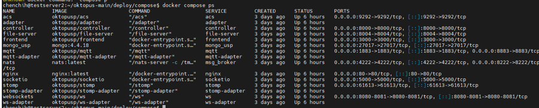
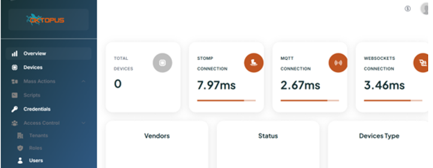
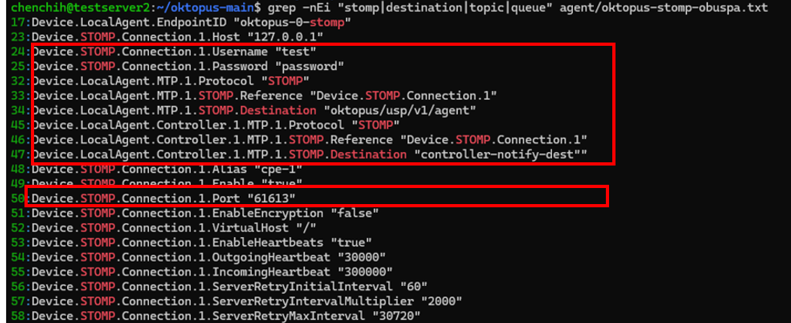
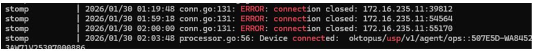
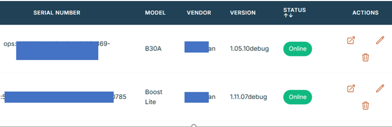

# Setup Oktpus (opensource)

I previously shared how to set up an ACS server (GenieACS) for TR-069. Today, I want to share a related tool: a TR-369 USP STOMP server. If you work in the networking field, you are likely familiar with TR-069 and TR-369 standards from the Broadband Forum. I’ll walk you through the setup and usage. I’ll show you how to get this server running quickly so you can skip the long documentation and get straight to the results.

Please refer more detail on [Oktpus offical](https://www.oktopus.app.br/) [Oktpus git](https://github.com/OktopUSP/oktopus)

## Installation

### 1. Install docker and related tool
```
sudo apt install -y software-properties-common 
sudo add-apt-repository -y universe
sudo apt install -y docker.io docker-compose-v2 wget unzip
```
### 2. Docker Version

```
sudo usermod -aG docker $USER
newgrp docker
docker --version
#Docker version 28.2.2, build 28.2.2-0ubuntu1~25.04.1

```
### 3. Download oktpus USP tool
```
#download 
wget https://github.com/OktopUSP/oktopus/archive/refs/heads/main.zip -O oktopus.zip 

#unzip 
unzip oktopus.zip
```

### 4. Edit controller setting
- Generate the secret key and copy the key

```
#navigate to the compose path
cd ~/oktopus-main/deploy/compose/

#generate secret key 
openssl rand -hex 32

```

- Edit `.env.controller` and paste your key inside

```
#edit cfg and paster your secret key inside
nano .env.controller
#paster your key inside
SECRET_API_KEY=mysecretkey.......
```

### 5. edit mogo setting in yaml config file
We need to edit the mongo version to be able to register your account. If you don't do this step then probably you will not be able to register an account and not able to login. 

- change your mongo image version
```
sudo nano docker-compose.yaml
image: mongo:4.4.18
```

- Note: delete your mongo database and recreate 
If mogogo file is empty then you can skip this version.  
If you want to register your UI account or forger your account then please delete mogodb folder which store your db
```
cd ~/oktopus-main/deploy/compose
sudo rm -rf ./mongo_data
mkdir -p ./mongo_data

```

### 6. Run Oktpus
```
cd ~/oktopus-main/deploy/compose
COMPOSE_PROFILES=nats,controller,cwmp,mqtt,stomp,ws,adapter,frontend docker compose up -d
```

### 7. Check your process running
```
docker compose ps
```
The format is messy and ugly, you can format it this way
```
docker ps --format "table {{.Names}}\t{{.Status}}\t{{.Ports}}"
```


### 8. Access to UI

> http://<IPaddress>

It should refirect to register page in case it's does please navigate this url `http://172.21.201.110/auth/register`

After register please login which will look like this





## Setting your DUT Device
Now let add the realted Server information into your CPE devices ex:mesh/router or etc

### 1. We need to know STOMP server realted information first
Get the realted info and copy it, we need to paste into our DUT 
```
cd ~/oktopus-main
grep -nEi "stomp|destination|topic|queue" agent/oktopus-stomp-obuspa.txt
```



### 2. Access to your DUT Devices and add into it
My CPE command might not be same as your, I use openwrt as example
```
dm_trigger set Device.STOMP.Connection.1.EnableEncryption=0
dm_trigger set Device.STOMP.Connection.1.Host=<yout IPaddress> 
dm_trigger set Device.STOMP.Connection.1.Port=61613
dm_trigger set Device.LocalAgent.MTP.1.STOMP.Destination=oktopus/usp/v1/agent
dm_trigger set Device.LocalAgent.Controller.1.MTP.1.STOMP.Destination=controller-notify-dest
dm_trigger set Device.STOMP.Connection.1.Username=test
dm_trigger set Device.STOMP.Connection.1.Password=password

```

### 3. your Devices will register, you can check STOMP server log 
```
docker compose logs -f stomp stomp-adapter controller | egrep -i "connect|login|auth|reject|error|subscribe|destination|usp|endpoint"
```
You should see connected 



### 4. Access to your UI and check is it connected on Device Page




## Reference
- https://docs.oktopus.app.br/