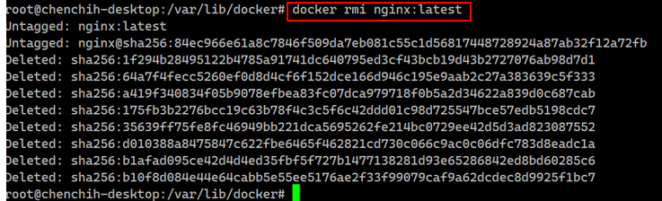

# Ngnix http server 

This is an easy NGINX HTTP server setup, an easy method of installation

## NGINX Setup Ubuntu

### Basic Default setting

#### Step1. Install Nginx
```
sudo apt install nginx -y
```

#### Step2. show nginx status

Verify Nginx is Running,  show status

```
sudo systemctl status nginx
```

#### Step3. Set up the Firewall settings

```
sudo ufw allow 'Nginx HT'
sudo ufw reload
```

#### Step4: Navigatethe  browser to test Nginx

Access your website should have nginx home website 
```
http://172.21.201.250
or
http://127.0.0.1
```


### Change Index page to file management
If you want to display your index home directory file management
#### change permission
```
sudo chmod 644 /var/www/html/
```
#### edit configure setting
```
sudo nano /etc/nginx/sites-available/default
    location / {
        try_files $uri $uri/ =404;
        autoindex on; # <--- Add this line
    }
```
#### reload and apply configure

- reload: 
```
sudo nginx -t
```

- apply configure
```
sudo systemctl reload nginx
```

#### Rename your index html file name
- Change your index.html name to another name

```
sudo mv /var/www/html/index.nginx-debian.html /var/www/html/index.nginx-debian.html.bak
```

- Access ngnix website will see the index will show like file management like below


## Docker Setting
If you have some specfic version that does not match or is incompatible with the current OS version, then probably an alternative method is using Docker to pull down the container and install it without reinstalling OS.

### Install Docker 

- install Docker
```
sudo apt update
sudo apt install docker.io -y
```

- enable and start Docker

```
sudo systemctl start docker
sudo systemctl enable docker
sudo usermod -aG docker chenchih # Add your user to the docker group
# Remember to log out and log back in (or reboot) for the group change to take effect
```

### Test Docker 
Test to make sure Docker command works or not

```
docker run hello-world
```

### pull nginx package 

```
#Pull or Run Nginx in Docker
docker pull nginx:latest
```
### Run Nginx Container
```
docker run --name my-nginx -p 8080:80 -d nginx:latest
```

> These options are:
>> - `--name my-nginx`: Gives your container a memorable name.
>> - `-p 8080:80`: Port mapping. Your Pi’s 8080 will point to the container’s 80.
>> - `-d`: Detached mode (runs in the background).
>> - `nginx:latest`: The image to use.


### Check Container running?
- List container running with process id 
```
docker ps -a # Lists all containers, including  stopped items
```


- show local images 
```
docker images
```


### Access Nginx http server

You can access http://localhost:8080 or instead use your IP address like http://<your_pi_ip_address>:8080 it will look like below:


### Stop and remove the Container (Cleanup)
- stop container name
```
docker stop my-nginx # Stops the running container
docker rm my-nginx # Removes the container instance
```
- list container again
```
docker ps -a
```


- remove docker image 
```
docker rmi nginx:latest
```




