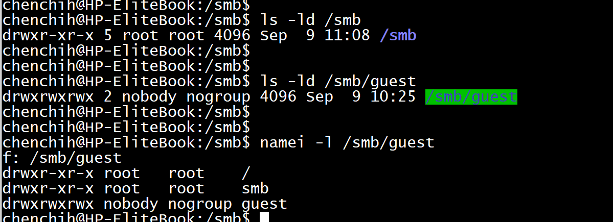
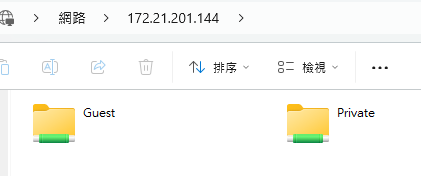
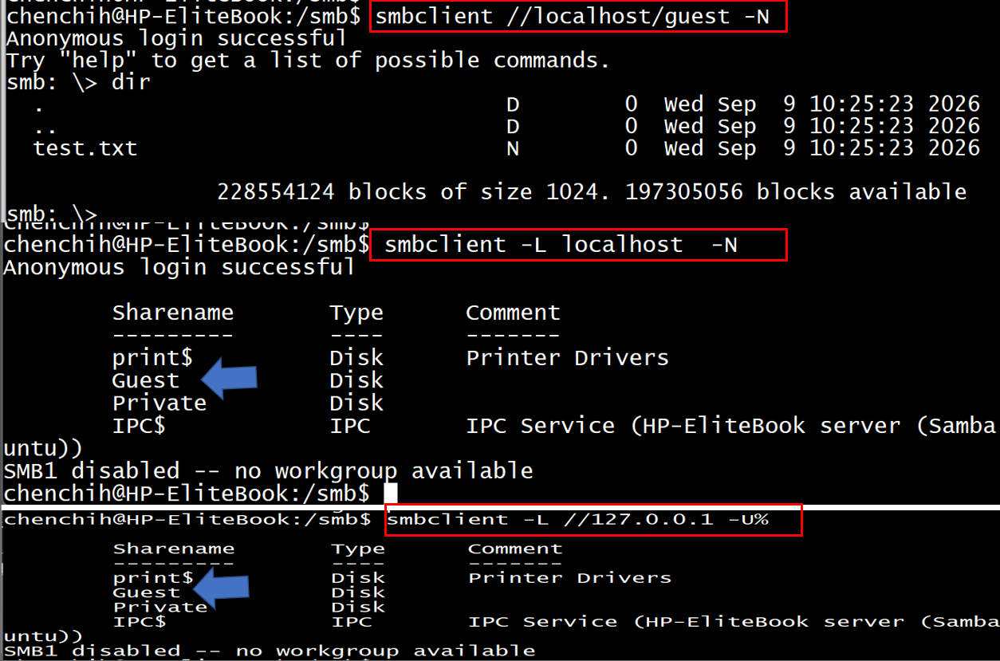

# Setup SMB server 
This tool allow you to upload and download file lor folder in a network drive without any cli commmand. 

- Ubuntu 24.04
- inital release: 2026.09.09
Please refer my smb.conf for more detail setting


## Setup SMB 

1.Install Samba
```
sudo apt update
sudo apt install samba -y
```

2. Create and configure shared folders

- Guest account (no password)

```
# Create the directories
sudo mkdir -p /smb/guest

# Configure the 'no account' guest folder (open to everyone)
sudo chown nobody:nogroup /smb/guest
sudo chmod 777 /smb/guest
```

- Local Network

```
# set account password for smb
sudo smbpasswd -a chenchih

# Create the directories
sudo mkdir -p /smb/private

# Configure the 'account' secure folder (restricted to you)
sudo chown chenchih:chenchih /smb/private
sudo chmod 755 /smb/private
```

You can Check /smb/guest permissions

```
ls -ld /smb
ls -ld /smb/guest
namei -l /smb/guest
```




3. Modify smb configure 

```
sudo cp /etc/samba/smb.conf /etc/samba/smb.conf.bk
sudo nano /etc/samba/smb.conf
```

Please edit like below

```
[guest]
path = /smb/guest
browsable = yes
writable = yes
guest ok = yes
read only = no
force user = nobody

[private]
path = /smb/private
valid users = chenchih
browsable = yes
writable = yes
guest ok = no
read only = no
```


4. restart services 

```
# restart 
sudo systemctl restart smbd

# check status
sudo systemctl status smbd --no-pager

# start smb on boot 
sudo systemctl start smb

# firewall (optional)
sudo ufw allow Samba
```

## SMB clinet Make connection

You just have to use shortcut key `win`+`r` and press `\\ipaddresss` will open a share folder. 

If you're window 10 or 11 it will have error, please run powershell as administration and run below command to fix this issue:
```
Set-SmbClientConfiguration -EnableInsecureGuestLogons $true -Force
Set-SmbClientConfiguration -RequireSecuritySignature $false -Force
```
By running these commands, you manually forced Windows to downgrade its modern security standards to allow the older, open-access Samba protocol to function.





## Other Command to use

Yu can check whether you samba is working or not

### Test the guest share locally

### Test Connection 
- Ubutnu
```
sudo apt install smbclient -y
```

Can connect local side to test connection work or not
```
#guest no password
smbclient //localhost/Guest -N  
smbclient -L //127.0.0.1 -U%

# password
smbclient //localhost/Private -U chenchih
```

`-n`: no password, and `-u` empty username and empty password





- window powershell

```
Test-NetConnection -ComputerName 172.21.201.144 -Port 445


# connection
net use \\172.21.201.144\Private /user:chenchih *

# delete drive
net use * /delete /y
```


### Multiply authenticated users
if later you want to have account like alice, bob or etc
```
#create a Linux group
sudo groupadd smbusers

#Add users:
sudo usermod -aG smbusers chenchih
sudo usermod -aG smbusers alice
sudo usermod -aG smbusers bob

#Set the directory
sudo chown root:smbusers /smb/private
sudo chmod 2770 /smb/private
```

add into config 
```
[Private]

    path = /smb/private

    browseable = yes
    read only = no

    guest ok = no

    valid users = @smbusers

    force group = smbusers

    create mask = 0660
    directory mask = 0770

    force create mode = 0660
    force directory mode = 0770
```

Each person still needs a Samba password:
```
sudo smbpasswd -a alice
sudo smbpasswd -a bob
```