# SSH Connection Note 

Today I want to make some note on how to use SSH include generate key and connect without password. I will show you:
- case1: generate under local side (clinet), this is mostly used for most people 
- case2: generate under server side, I recentely study this method. 

Please install ssh package before using it: `sudo apt install openssh-server`

## Acces SSH with key 

When you use the key to connect server, you will need a public key, and private key:
- private key: Stored on your local machine and must be kept safe. 
- public key: Can be stored anywhere and is linked to the private key.

### CASE 1 Ubuntu Desktop as server
This method is use often 
- Bsic Envirnoment information
	- Local PC: window
	- Server: Ubuntu Desktop/Server
	

Let me show most commonly use method when you access to server side with key. You can refer to below picture on diagram

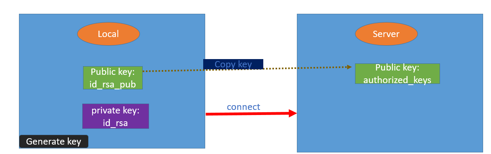


- Step1: Generate key under local side(window)
You can either use which algorithms you like `ssh-keygen -t rsa -b 4096` or `ssh-keygen -t ed25519`
Note: recommend use ed25519, but in this example I will show using rsa method. 


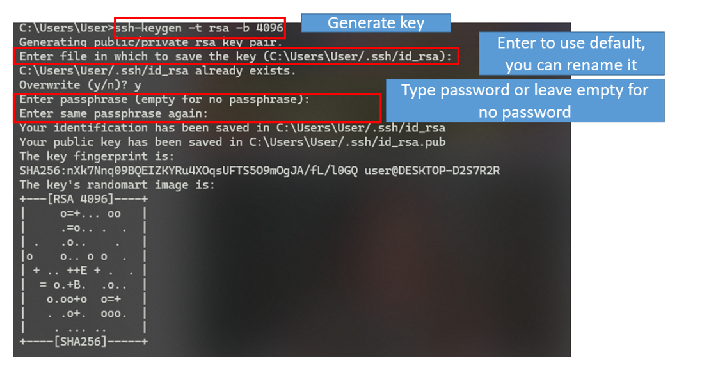

- Step2: List directory it will generate public and private key


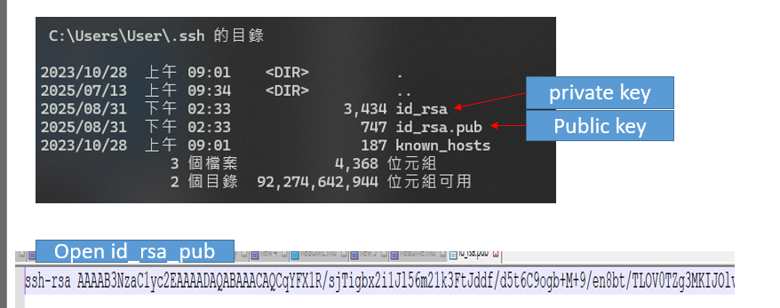


- Step3: copy id_rsa.pub into server, with the `ssh-copy-id` or copy file 

If you use linux it should have the command. 

> Linux
```
ssh-copy-id -i id_rsa.pub root@192.168.1.103
```

> window
```
type %USERPROFILE%\.ssh\id_rsa.pub | ssh chenchih@192.168.1.103 "cat >> .ssh/authorized_keys"
```
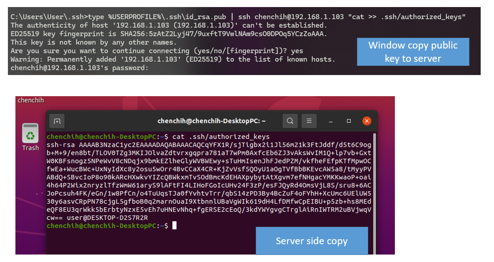

Note: You can manually copy the `id_rsa.pub` to server side `~/.ssh/` and change the file to `authorized_keys` can also work. 

Let compare public key under local and server side:

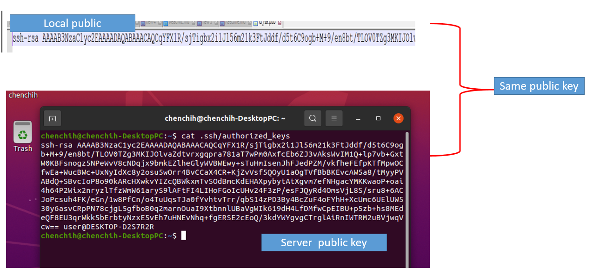


- Step3: modify your `sshd_config` to access by key 

> Note: 
>> Ubuntu Server defaults to using SSH keys for remote access via SSH.
>> Ubuntu Desktop defaults to using a password for user authentication and login.
In Ubuntu Desktop default ssh config `PasswordAuthentication` is been set as `yes` which is login with password.

Please modidy `/etc/ssh/sshd_config` and change `PasswordAuthentication no` and restart sshd
```
sudo nano /etc/ssh/sshd_config #edit sshd_config
PasswordAuthentication no 

#restart sshd
sudo systemctl restart sshd
```
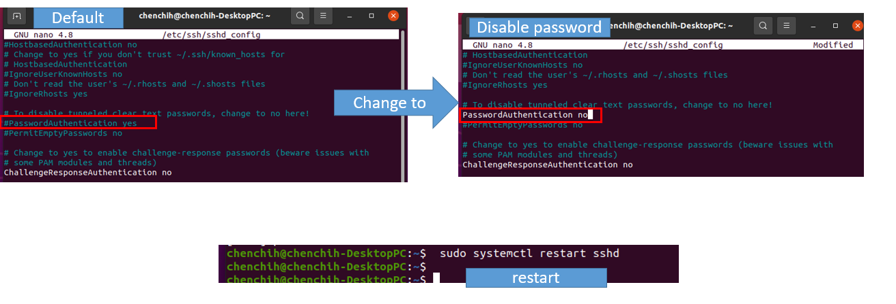

- Step 4 connect ssh with key, no password

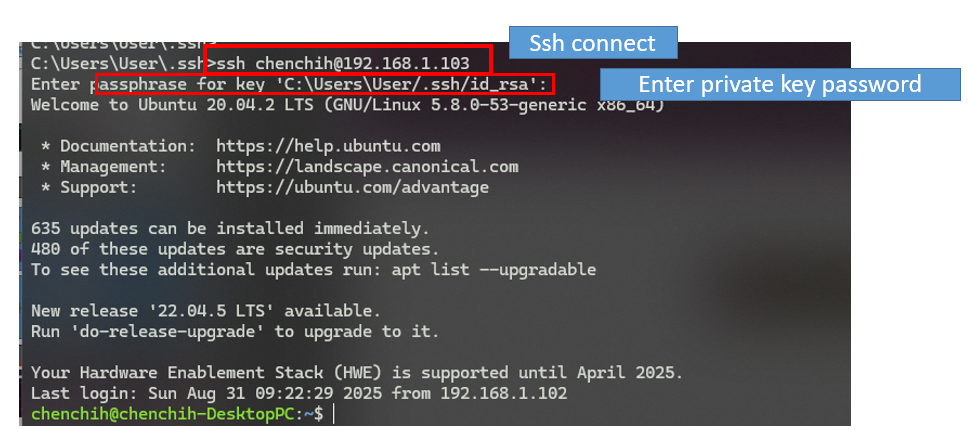


Now you can now ssh to server side, but you can put your host IP in config file, so next time no need to type IP address, just modify the config file. 

create file .ssh/config and put these information in it 
```
Host test
    HostName 192.168.1.103
    User chenchih
    Compression yes
```

use the command to ssh server: `ssh test` will make ssh connection without typing long HostName
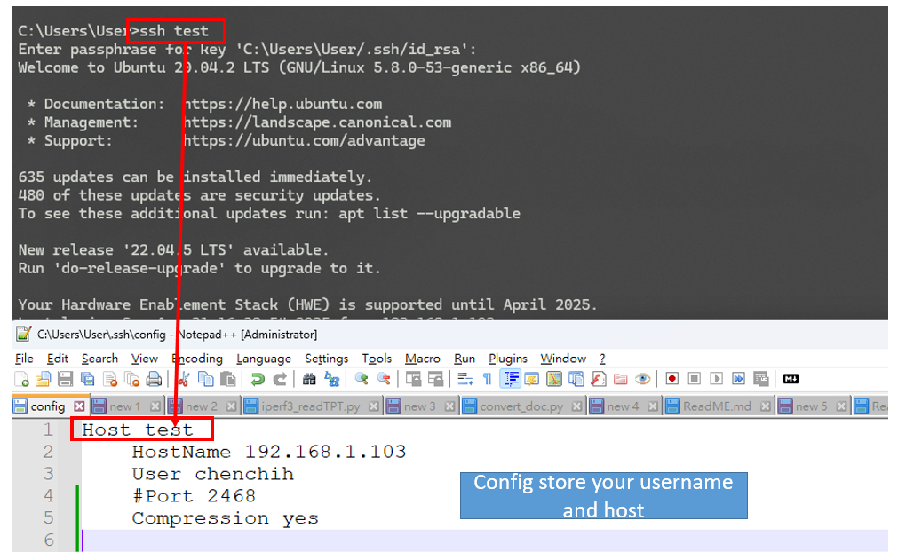


#### Use Putty 
Continue from above if you use putty it will pop error "No support authernication methods available" , because putty have it's own private and public key, and I will how how it work. 

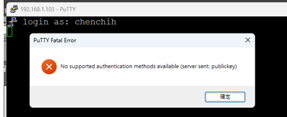

- Step1: open PuTTYgen.exe, if you have install putty it will contain PuTTYgen this tool

- Step2: click load button and choose `id_rsa` your private key
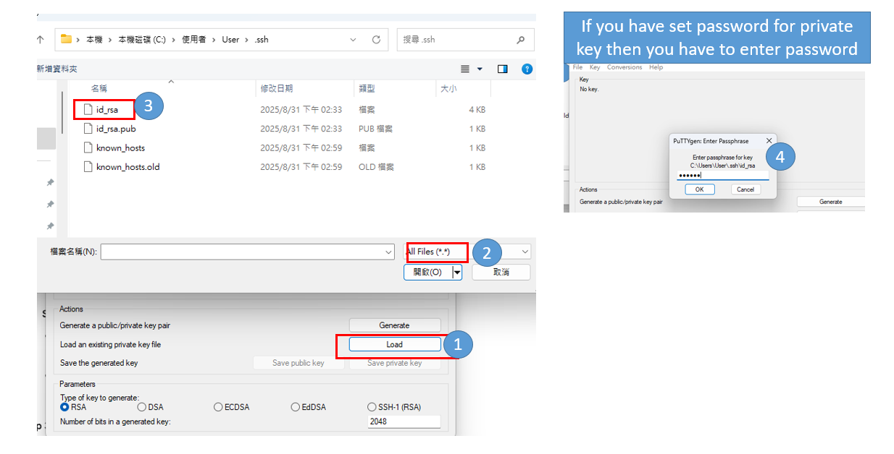

- Step3: save as private key 
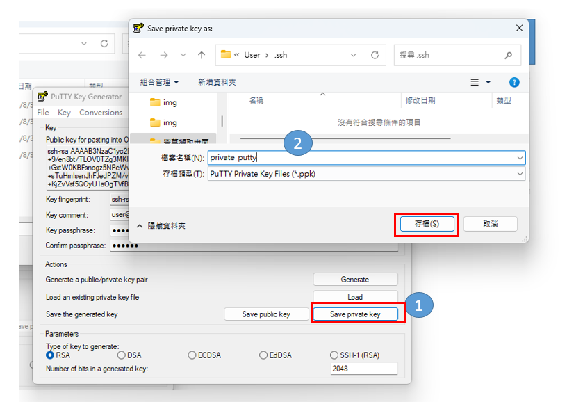

- Step4: select the psk file and login success
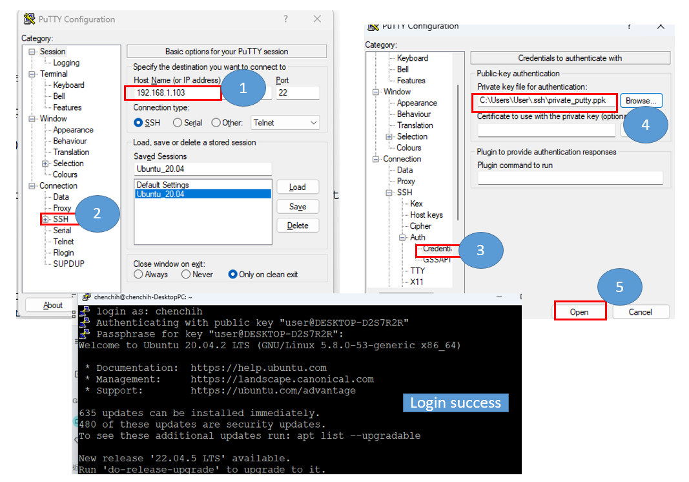


this is the method of using thirdparty tool 

#### Terateam 
If you use terateam will also have problem, you just follow the step below. 

- Step1: open terateam and click setup>ssh authentication> 
- step2: enter your username and choose the private key 
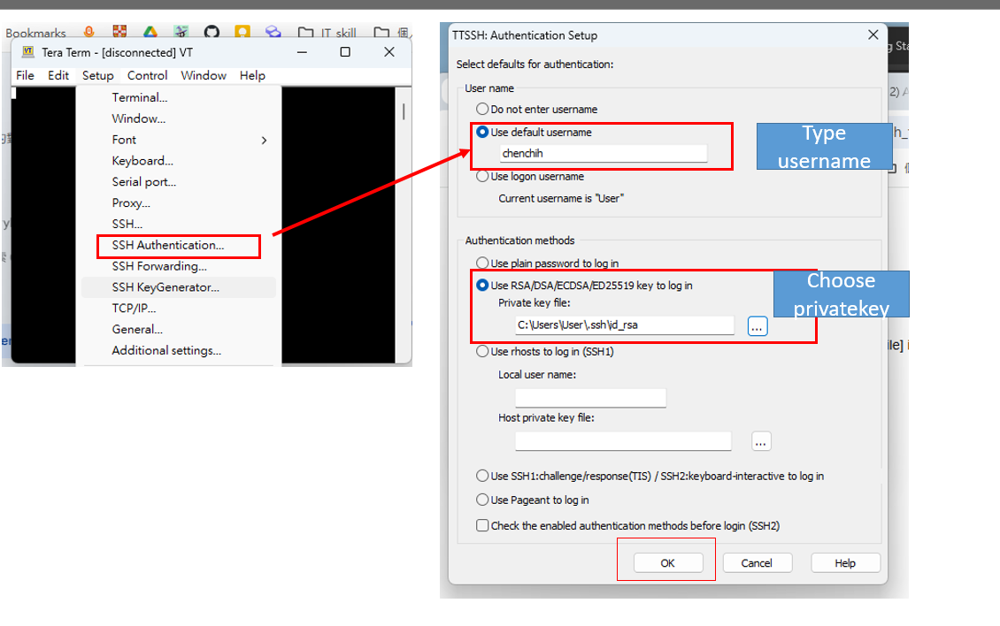


- step3: connect to server again 
I have set password for private key, if you didn't set password then you can leave as empty. 

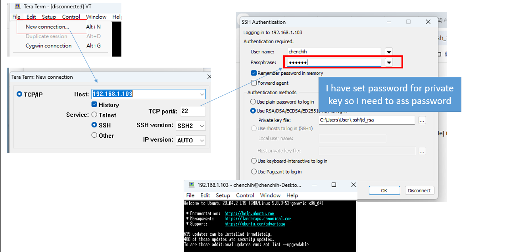


### Case2
- Bsic Envirnoment information
	- Local PC: window
	- Server: Ubuntu server

Why would you want to generate under server side? In some case like some devices ex: router, or system developer for some security issue might design user login without password, instead using the private key. User make ssh connection just out the private key in `.ssh` it will conenct from clien to server.

Below is the diagram if you generate key under server:
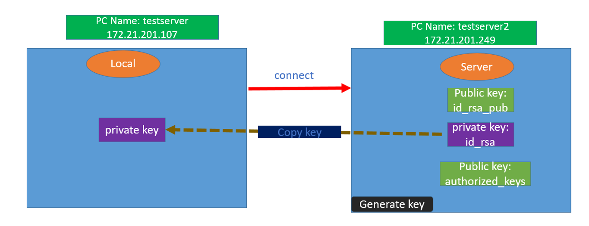

- 1. ubuntu server generate key
```
ssh-keygen -t rsa -b 4096
```

- 2. added the public key to authorized_keys
```
cat ~/.ssh/id_rsa.pub >> ~/.ssh/authorized_keys
```

- 3, set permission
```
chmod 700 /home/chenchih/.ssh
chmod 600 /home/chenchih/.ssh/authorized_keys
chmod 600 /home/chenchih/.ssh/id_rsa   # Only if you copied id_rsa there
chmod 644 /home/chenchih/.ssh/id_rsa.pub
```

In case if you set using root account to set above permission, please change to normal user, and change ownership and groupship to username

```
sudo chown -R chenchih:chenchih /home/chenchih/.ssh
```

- 4. sudo systemctl restart sshd

- 5. copy your id_rsa (private key) into window pc


## reference

- https://phoenixnap.com/kb/generate-setup-ssh-key-ubuntu
- https://medium.com/@natlee_/ubuntu-%E8%88%87-windows-%E4%BD%BF%E7%94%A8-ssh-%E9%87%91%E9%91%B0%E5%BF%AB%E9%80%9F%E7%99%BB%E5%85%A5%E7%9A%84%E6%96%B9%E6%B3%95-823a8b0211e3
- https://www.cloudpanel.io/tutorial/set-up-ssh-keys-on-ubuntu-20-04/
- https://www.youtube.com/watch?v=ia86qxIajCM
- https://askubuntu.com/questions/46930/how-can-i-set-up-password-less-ssh-login