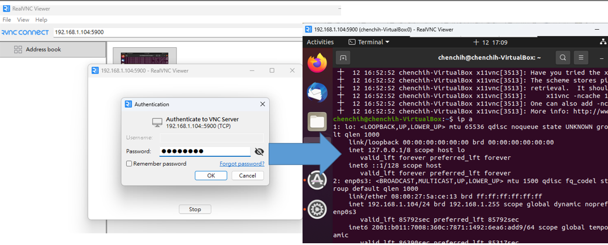

# VNCServer Setup

If you like to use a remote GUI rather than cli command like `ssh`, then VNCServer is a better option. You just have to set up a VNC server on your Ubuntu Server, and you can install VNC viewer on a Windows PC. It will allow you to remotely to your Ubuntu Server. 

VNCViewer I like to use [realvnc](https://www.realvnc.com/en/), where there are many related VNCViewer tools you can download or install

- Update Note status
	- [X] x11vnc: tested PASS
	- [ ] tigervnc: not tested yet

## x11vnc method

- Step1: install lightdm
```
sudo apt update
sudo apt install lightdm -y #choose lightdm
sudo reboot
```

- Step2: Install x11vnc
```
sudo apt install x11vnc -y
```
- Step3: configure x11vnc services

> Edit this file: 
>> `sudo nano /lib/systemd/system/x11vnc.service`

Copy and paste these commands, `password` change to your own password in this case it uses password as `password`
```
[Unit]
Description=x11vnc service
After=display-manager.service network.target syslog.target

[Service]
Type=simple
ExecStart=/usr/bin/x11vnc -forever -display :0 -auth guess -passwd password
ExecStop=/usr/bin/killall x11vnc
Restart=on-failure

[Install]
WantedBy=multi-user.target
```

- Step4: Enable x11vnc services
```
#restart services
systemctl daemon-reload

#enable and start x11vnc services
systemctl enable x11vnc.service
systemctl start x11vnc.service

#check if services are enabled
systemctl status x11vnc.service 
```

Check the services is running, and you can see the port, which you will use this port to remote access


- Step5: disable ScreenLock

Access to `Setting>Privacy>ScreenLock` and disable it


- Step6: VNCViewer to access the Server

Since in Step4 my port is `5900` so I will access `192.168.1.104:5900`



## tigervnc method

- Install the Xfce Desktop
VNC requires a desktop environment using Xfce is a lightweight desktop tool for Linux

If not install, your screen might be a black screen even if you remotely succeed

```
sudo apt-get update
sudo apt-get install xfce4 lightdm-gtk-greeter dbus-x11 autocutsel
```

- Install TightVNC Server
```
sudo apt-get install tightvncserver
```

-  Start VNC Server services 
We need to start initial VNC server, which will ask for your password, and show your VNC server port. The port is important, it tells VNCViewer to connect with which port. 

Note:　Please DO NOT　run this as the root user. 
```
vncserver`
```

- Stop vnc server
```
vncserver -kill :1
```

-  Edit the xstartup Script

You have to modify the file `.vnc\xstartup`, but `.vnc` is a hidden file, so you might not see it. You have to use command line to edit this file name and copy information below in it

```
unset SESSION_MANAGER
[ -x /etc/vnc/xstartup ] && exec /etc/vnc/xstartup
[ -r $HOME/.Xresources ] && xrdb $HOME/.Xresources
autocutsel -fork
startxfce4 &
```
- Start vncserver
```
vncserver :1 -geometry 1280x720
```

- connect vncserver

If you are Windows you might need a VNC viewer tool such as vncviewer or utravnc, something like it.

> Connect it by 
>> `<IP address> <port> `, which port is optional


- Enable multiple users use this command:
```
vncserver :1 -geometry 1280x720 -alwaysshared
```

- Check your tigervnc process
```
ps aux | grep tightvnc
```

- Automatically run VNCServer on startup

You have to go in this directory `cd /etc/systemd/system`

> Create VNC services witha  single Desktop
>> `sudo vim vncserver@1.service` , this is single vnc desktop1, if you ahve multiply please add more file 

```
[Unit]
Description=Start VNC Server With Desktop ID :%i 
After=multi-user.target network.target

[Service]
Type=forking

# Replace your_username with the linux user that connects to this desktop
User=your_username
ExecStartPre=-/usr/bin/vncserver -kill :%i > /dev/null 2>&1
ExecStart=/usr/bin/vncserver :%i -geometry 1280x720 -alwaysshared
ExecStop=/usr/bin/vncserver -kill :%i

[Install]
WantedBy=multi-user.target
```
- Start tigervnc server`
```
#reload
sudo systemctl daemon-reload

#start services
sudo systemctl enable vncserver@1.service

#stop or restart
sudo systemctl stop vncserver@1.service
sudo systemctl restart vncserver@1.service

```

- Change vnc password 
```
vncpasswd
```

More details, please refer [configserverfirewall](https://www.configserverfirewall.com/ubuntu-linux/vnc-ubuntu-server-24/)

## Reference: 
- https://www.crazy-logic.co.uk/projects/computing/how-to-install-x11vnc-vnc-server-as-a-service-on-ubuntu-20-04-for-remote-access-or-screen-sharing
- https://www.youtube.com/watch?v=3K1hUwxxYek&t=271s
- https://www.configserverfirewall.com/ubuntu-linux/vnc-ubuntu-server-24/
