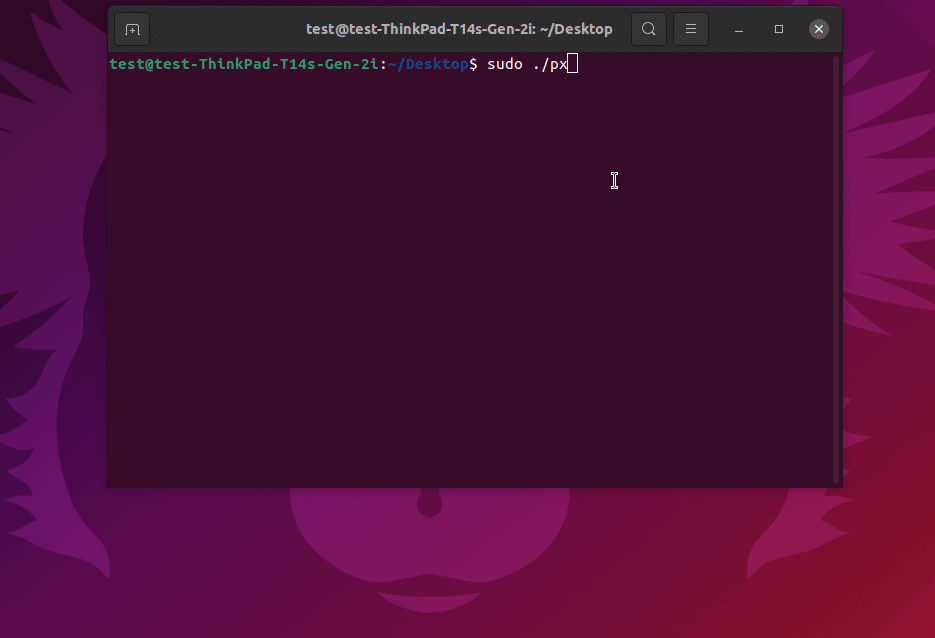

# PXE Server Setup Script
* Description: This is a script for automatic setup PXE Server under UBUNTU20.04

## Automation Script

- Still ongoing(I will update soon)

- How to run the script:

### Script Description
- Menu 1.Install package

- Menu 2.Install package
- Menu 3.Set PXE Boot MENU

- Menu 4.Use Default PXE BOOT MENU

- Menu 5.copy OS image and kernel

- Menu 6.Set Default setting IP addr/tftp dir
- Menu 7.Show Default setting IP addr/tftp dir


## Basic Manual setup
1. download related packages 

If using DHCPD package 
```cmd
sudo apt-get update 
sudo apt-get install samba 
sudo apt-get install tftpd-hpa
sudo apt-get install vsftpd 
sudo apt-get install apache2 
sudo apt-get install nfs-kernel-server
sudo apt-get install isc-dhcp-server 
```
If using DNSMAQ 
```cmd
sudo apt-get update 
sudo apt-get install samba 
sudo apt-get install vsftpd 
sudo apt-get install apache2 
sudo apt-get install nfs-kernel-server
sudo apt-get install dnsmasq
```

please Note it's not necessary to install all services http/vsftp/samba/nfs.

2. create tftpboot directory
```cmd 
#create tftpboot directory
$mkdir -pv /tftpboot/{images,kernels,BIOS,UEFI}
$chmod 777 -R /tftpboot
```
3. Install required pxe boot files
```cmd 
$sudo apt-get install syslinux pxelinux
```
4. Configure TFTP (if your're using DNSMASQ is your DHCP skip this item)
```
cat << EOF > /etc/default/tftp-hpa
TFTP_DIRECTORY="/tftpboot"
RUN_DAEMON="yes"
OPTIONS="-l -s /tftpboot"
EOF
```
6. Set static IP address 
```cmd
cat << EOF > /etc/netplan/00-installer-config.yaml
network:
  version: 2
  #renderer: networkd
  renderer: NetworkManager
  ethernets:
    #enp4s0:
    $ethInt:
      dhcp4: no
      addresses:
        - 192.168.2.1/24           
      gateway4: 192.168.2.254
EOF
```
```
$sudo netplan apply
```

7. configure DHCP Server and assign your Lan inerface
* Check your lan interface :  `$ip -a`
* edit your lan interface `vi /etc/default/isc-dhcp-server` add correct interface `INTERFACESv4="ens33"`
* configure dhcp server
```
cat << EOF > /etc/dhcp/dhcpd.conf
ddns-update-style none;
default-lease-time 43200;
max-lease-time 86400;
option arch code 93 = unsigned integer 16; # RFC4578
subnet 192.168.2.0 netmask 255.255.255.0 {
option routers 192.168.2.1;
option broadcast-address 192.168.2.255;
range 192.168.2.2 192.168.2.200;
#range dynamic-bootp 192.168.2.2 192.168.2.254;
next-server 192.168.2.1;
if option arch = 00:07 or option arch = 00:09 {
   filename "UEFI/syslinux.efi";
}
#arm platform
else if option arch = 00:0b {
  filename "/UEFI/aarch64/bootaa64.efi";
 }
 else  {
   filename "BIOS/pxelinux.0";
 }
}
EOF
```
9. Configure DNSMASQ 
```
cat << EOF > /etc/dnsmasq.conf
interface=ens33
bind-interfaces
domain=koti.local
 
#dhcp-range=ens33,192.168.100.100,192.168.100.240,255.255.255.0,8h
dhcp-range=$ethInt,192.168.2.2,192.168.2.254,255.255.255.0,8h
dhcp-option=option:router,192.168.2.1
dhcp-option=option:dns-server,192.168.2.1
dhcp-option=option:dns-server,8.8.8.8
 
enable-tftp
#tftp-root=/netboot/tftp
tftp-root=/tftpboot
#dhcp-boot=pxelinux.0,linuxhint-s20,192.168.2.1
dhcp-boot=pxelinux.0
pxe-prompt="Press F8 for PXE Network boot.", 2
# PXEClient:Arch:00000
pxe-service=X86PC, "Boot BIOS PXE", BIOS/pxelinux
# PXEClient:Arch:00007
pxe-service=BC_EFI, "Boot UEFI PXE-BC", UEFI/syslinux.efi
# PXEClient:Arch:00009
pxe-service=X86-64_EFI, "Boot UEFI PXE-64", UEFI/syslinux.efi
EOF
```
10. Setup PXE Boot files
``` 
#bios system
cp -av /usr/lib/PXELINUX/pxelinux.0 /tftpboot/BIOS
cp -av /usr/lib/syslinux/modules/bios/{ldlinux.c32,libcom32.c32,libutil.c32,vesamenu.c32} /tftpboot/BIOS
#UEFI System
cp -av /usr/lib/syslinux/modules/efi64/{ldlinux.e64,libcom32.c32,libutil.c32,vesamenu.c32} /tftpboot/UEFI
cp -av /usr/lib/SYSLINUX.EFI/efi64/syslinux.efi /tftpboot/UEFI 
```
11. copy images and kernels
```
#1. mount you images
$mount -o loop ubuntu-20.04.3-desktop-amd64.iso /mnt

#2. copy kernel into kernel directory
#Ubuntu kernel location
$mkdir –pv /tftpboot/kernels/ubuntu2004
$cp -av /mnt/casper/{initrd,vmlinuz} /tftpboot/kernels/ubuntu20.04

#Fedora/RHEL/Centos kernel location
$cp -av /mnt/isolinux/{initrd.img,vmlinuz} /tftpboot/kernels/centos

#window
$cp -av /usr/lib/syslinux/memdisk /tftpboot/kernels

#3. copy all images
$mkdir –pv /tftpboot/images/ubuntu2004
$rsync -av --progress /mnt/* /tftpboot/images/ubuntu2004
$umount /mnt
```
12. setup http
`ln -s /tftpboot/images /var/www/html/`
13. setup vsftpd
```
$cd /srv/ftp/
$mkdir –pv pub
#change permission 
$chmod –R 777 /srv/ftp/pub

#configure vsftpd 
$vi /etc/vsftpd.config
anonymous_enable = yes

#copy your images to this directyory or mount from /tftpboot/images/XXX 
#create a images directory to store your images
$mkdir –pv /srv/ftp/pub/images
#since we can't use ln-s method, we can use mount method
sudo mount — bind /tftpboot/images /srv/ftp/pub/images/

#restart 
systemctl enable vsftpd
systemctl restart vsftpd
systemctl status vsftpd

```
14 setup nfs
`$vi /etc/exports`
```
/tftpboot/images/   192.168.2.0/24(ro,no_root_squash,no_subtree_check)
```
```
#restart nfs
$systemctl restart nfs-kernel-server`
$exportfs -a
```

15 setup samba
`$vi /etc/samba/smb.conf`
```
[global]
  workgroup = WORKGROUP
  map to guest = bad user
  usershare allow guests = yes
[windows]
  browsable = true
  read only = yes
  guest ok = yes
  path = /tftpboot/images/windows
```
rstart smb : `systemctl restart smbd'


16 adding pxe Boot menu option
`$mkdir -vp /tftpboot/pxelinux.cfg/`
`$touch /tftpboot/pxelinux.cfg/default`

 `$vi /tftpboot/pxelinux.cfg/default`
```
default menu.c32
prompt 0
timeout 300
TIMEOUT local
menu title ########## PXE Boot Menu ##########
MENU LABEL CentOS 7 x64 FTP
kernel /images/centos7/vmlinuz
append initrd=/kernels/centos7/initrd.img \ method=ftp://192.168.2.1/pub/images/centos75/ ip=dhcp
label CentOS 7x64 http 2021
MENU LABEL CentOS 7 x64 http   
kernel /images/centos7/vmlinuz
append initrd=/kernels/centos7/initrd.img method=http://192.168.2.1/pub/images/centos75/ ip=dhcp
label install ^Install centos 7
menu label ^Install centos 7 NFS
kernel /kernels/centos7/vmlinuz keymap=us lang=en_US ip=dhcp method=nfs:192.168.2.1:/nfs_share/centos
append initrd=/images/centos7/initrd.img

label CentOS 8.5x64 ftp 2021
MENU LABEL AlmaLinux-8.5 x64 FTP [ok]
kernel /images/AlmaLinux-8.5/vmlinuz
append initrd=/images/AlmaLinux-8.5/initrd.img \ method=ftp://192.168.2.1/pub/AlmaLinux-8.5/ ip=dhcp
title [Leopard_uEFI] CentOS 6.4 x64 for guifullap ks
kernel /kernel/centos6.4/vmlinuz ip=dhcp #ks=http://192.168.2.1/kickstart/centos6.4/guifullap.ks
ks=http://192.168.2.1/guifullap.ks
initrd /kernel/centos6.4/initrd.img

label install1
menu label ^Install Ubuntu NFS
kernel /kernels/ubuntu2004/vmlinuz
append initrd=/kernels/ubuntu2004/initrd \ nfsroot=192.168.2.1:/tftpboot/images/ubuntu2004 ro netboot=nfs boot=casper ip=dhcp ---
label UBUNTU test
MENU LABEL UBUNTU 2004 test x64 http ISO file
kernel kernel_boot/ubuntu/ubuntu20.04/vmlinuz
initrd= kernel_boot/ubuntu/ubuntu20.04/initrd
append ip=dhcp vga=normal method=http://192.168.2.1/images/ubuntu-20.04.3-desktop-amd64.iso

label install
menu label ^Install Ubuntu 20.04 LTS Desktop try and install
kernel ubuntu2004/vmlinuz
initrd ubuntu2004/initrd
append ip=dhcp netboot=nfs \ nfsroot=192.168.100.11:/netboot/nfs/ubuntu2004/ boot=casper auto=true root=/dev/ram0 maybe-ubiquity

label install
menu label ^Install Ubuntu 20.04 LTS Desktop automatic install 
kernel ubuntu2004/vmlinuz
initrd ubuntu2004/initrd
append ip=dhcp netboot=nfs automatic-ubiquity boot=casper nfsroot=192.168.100.11:/netboot/nfs/ubuntu2004/ auto=true url=http://192.168.2.1/local-sources.seed splash toram ---

LABEL      winpe
MENU LABEL Boot Windows PE from network
KERNEL     /kernels/memdisk
INITRD     /images/winpe_amd64.iso
APPEND     iso raw
```
