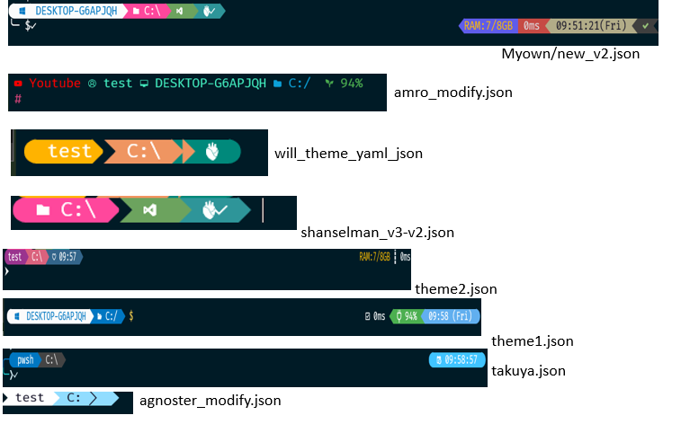

# Setup Fancy Terminal Oh-my-posh

This is a tutorial of setting up ohmyposh under Window, and WSL linux platform. In this page, I will show how to setup it:
## Description
I will show how to setup manual, I also write automation, please refer to the powershell script.
** Why should using it?**
Productive, Better Visualization 

### File:

- `Theme_customize`: I have design my own theme, and some theme  deveopler by other people online.
- `automation_ps_script`: store automation scipt for setup 
- `psreadline_profile.txt`: psreadline special character function
- `Microsoft.PowerShell_profile.ps1`: my current profile. 
- automationfile-directory: please refer these profile setting for reference
	- `setup_testing_automation_me.ps1`: automation installation 
	- `profile_basic.ps1`: short profile 
	- `profile1.ps1`: contain many useful function 
	- `psreadline_profile.txt`: psreadline great module you can use
	- `special_function_pluginNote.txt`: some function you can use
> Note
>> please refer `automationfile-directory` for more profile setting
>> please refer `Theme_customize` for customize theme 



## Part 1 Installation Tool
In this section let first installation the most important tool in ordder to use this fancy theme:
- **winget** : window installation package
Please check winget command under command promopt, if can use then you can skip. If not please downlaod and install using below command:
```
Invoke-WebRequest -Uri https://aka.ms/getwinget -OutFile #download 
Microsoft.DesktopAppInstaller_8wekyb3d8bbwe.msixbundle
#install
Add-AppxPackage Microsoft.DesktopAppInstaller_8wekyb3d8bbwe.msixbundle
``` 
 - **window terminal**: terminal to show logo
>　winget install Microsoft.WindowsTerminal

- **powershell core**: default powershell version 5.X, we need to use 7.x
>　winget  winget install Microsoft.Powershell

## Part2 Window powershell setting
[Ohmyposh](https://ohmyposh.dev/) url- this is the offical site which contain documentqtion on how to use and install. I will use my own way to install. You can also refer it, especially the theme, and advance setting. 

### Step 1: Download Ohmyposh Module
Please refer to [ohmyposh site](https://ohmyposh.dev/docs/installation/windows), 
### Step2: Download  nerd font 
Please refer [nerd font](https://www.nerdfonts.com/) to download and Install the font, if not when you install ohmyposh will not display correctly. 
> [nerd font download page](https://www.nerdfonts.com/font-downloads)
[ nerd font git download](https://github.com/ryanoasis/nerd-fonts/releases)

 2.1 Download font
 2.2 unzip or extract 
 2.3 install it 

### Step3:Open Window terminal and change some apperance 
3.1 Go to `setting>starup>`
default profile : `powershell core`
default terminal: `window terminal`
3.2 Change font to nerd font you download go to default or power shell core profile> appearance

You can also change by using the json file, open `windowterminal>open json file>` and find your own profile, and add the `color scheme` as your nerd font name. Please refer my `setting,json` for my setting. 
3.4 download color scheme(optional)
if you don't like the default color scheme, you can download on this [page](https://windowsterminalthemes.dev/).  Select your favorite theme press get theme, will copy kjson code. Go to setting.setting, and paste under color scheme. 
```

"schemes":
[
{
"background":  "#23262E",
"black":  "#23262E",
"blue":  "#0321D7",
"name":  "Aurora",
.................,
.................,
"white":  "#C74DED",
"yellow":  "#FFE66D"
}]
```
### Step4 Setup  Ohmyposh 
4.1 download and install
```
#install and download
winget install JanDeDobbeleer.OhMyPosh -s winget

#upgrade 
winget upgrade JanDeDobbeleer.OhMyPosh -s winget
```
After install you cna check using the command `oh-my-posh --version` to show version. 

4.2 activate the theme to check theme work or not
Default theme store in this location:  `C:\Users\<username>\AppData\Local\Programs\oh-my-posh\themes`
```
#list and display all theme
Get-PoshThemes –List
# set default theme 
oh-my-posh init pwsh | invoke-expression
```
There are cople of ways to set differen theme:
```
#method1 full path
oh-my-posh init pwsh --config C:\Users\test\AppData\Local\Programs\oh-my-posh\themes\atomic.omp.json' | Invoke-Expression
#or cd to theme folder and assign json
cd "C:\Users\test\AppData\Local\Programs\oh-my-posh\themes\"
oh-my-posh init pwsh --config "atomic.omp.json" | Invoke-Expression

#method2 url method in case of local theme location
oh-my-posh init pwsh --config 'https://raw.githubusercontent.com/JanDeDobbeleer/oh-my-posh/main/themes/jandedobbeleer.omp.json' | Invoke-Expression

#method 3 environment variable $env
oh-my-posh init pwsh --config "$env:POSH_THEMES_PATH\<themename>.omp.json" | Invoke-Expression
```
If you want to add same location as profile, which i will mention next step, you can use like this

**Understand $env:** 
We will use the $env, because of shorten the command, since it store as a variable, and you can indeed access environment variables. You can use this command `ChildItem env:`　to show all env variable. 

- **Set env:**  `Set-Item -Path env:MYCUSTOMVAR –Value <path location>`
- **remove env**:`$env:<name> = $null`


### Step5 adding profile
You will notice after open new session, the powershell or session will return default. The reason is you need to write into profile. Step4 is only temporary, after close terminal everything is lost. However, when you are debuing or creating theme, Step4 is a good method

```
#auto generate a profile, first time
New-Item -Path $PROFILE -Type File –Force
#edit profile
notepad $profile
#add code in step4 in this page 
oh-my-posh init pwsh --config "$env:POSH_THEMES_PATH\<themename>.omp.json" | Invoke-Expression
```
> profile location for powershell
>> **PS5.X:** C:\Users\test\Documents\WindowsPowerShell
>> 
>> **PS7.3:** C:\Users\test\Documents\PowerShell

> **Note:** 
if you want to store your theme json file same location as profile, you can use this command in profile:
```
$omp_config = Join-Path $PSScriptRoot ".\theme.json"
oh-my-posh --init --shell pwsh --config $omp_config | Invoke-Expression
```

### Step6 reload profile
After set the profile, you either open new session, or reload the session this command: `. $profile`

### recap and summary of the command
> window and powershell
```
#install and download
winget install JanDeDobbeleer.OhMyPosh -s winget

#activate theme for debug or temp
oh-my-posh init pwsh | invoke-expression
oh-my-posh init pwsh --config "$env:POSH_THEMES_PATH\<themename>.omp.json" | Invoke-Expression

#automatic generate profile (first time)
New-Item -Path $PROFILE -Type File –Force

#add theme into profile 
oh-my-posh init pwsh --config "$env:POSH_THEMES_PATH\<themename>.omp.json" | Invoke-Expression
```

> WSL and Ubuntu
- Step1 install ohmyposh
please create `bin` directory `mkdir ~/bin`

```
#change term color to 256 
TERM=xterm-256color

#install ohmyposh
curl -s https://ohmyposh.dev/install.sh | bash -s -- -d ~/bin
```
- Step2 add profile
```
#adding profile, add below into the file
$vi .bash_profile 

export PATH=$PATH:/home/test/bin
#POSH_THEME="paradox"
#eval "$(oh-my-posh init bash --config ~/themes/$POSH_THEME.omp.json)"
#atomic
#eval "$(oh-my-posh init bash --config ~/themes/powerline_2.omp.json)"
eval "$(oh-my-posh init bash)"
```


## Part3 WSL ubuntu setting 
Prequisite: please finshed the installation tool first, should installed:
- window terminal
- power shell core 7.X
- winget or other package installer tool


### Basic WSl Command 
- Check ubuntu version: `lsb_release -a`
- Check wsl command install: `wsl`
- list OS to install: `wsl --list --online`
- install ubuntu:`wsl --install -d ubuntu`

### WSL Directory 
- Default wsl home directory is `\\wsl.localhost\Ubuntu`, you can also use `\\wsl$\ubuntu`
- If you want to access to window drive:`/mnt/`
- change default director:
please go to window terminal and open setting.json, and change ubuntu porfile:
```
#starting driectory allow to go to root directory
"startingdirectory"://wsl$/ubuntu-20.04/home/user 
#or 
\\wsl.localhost\Ubuntu

# command line go to ~/home/username directory
"commandline":"wsl~" 
#this will give you the same as C:\Users\test which is the ~
```
### Step1 Install ohmyposh
1.1 Open Window Terminal, and type ubuntu (your ubuntu name) or switch to ubuntu
1.2 create a bin directory  `$mkdir bin`
2.3 add the bin directory to PATH
```
echo $PATH #should not have bin 
#edit .bashrc and add path to bin
$vi .bashrc
export PATH=$PATH:/home/test/bin
```
1.4 reload file or apply `source .bashrc` or `. ~.bashrc`
1.5 check $PATH should contain bin (optional)
1.6 download and install ohmyposh
Note: if you skip above step 1.1 ~ 1.4 might not be able to install 
```
#install with specfic location /bin
curl -s https://ohmyposh.dev/install.sh | bash -s -- -d ~/bin
```
### Step2 activate theme
```
eval "$(oh-my-posh init bash)"
```

### Step3 install nerd font
```
oh-my-posh font install
```
### Step4 write theme into profile
```
#change different theme
eval "$(oh-my-posh init bash --config ~/theme/atomic.omp.json)"
#write into profile
vi .bashrc
POSH_THEME="paradox"
eval "$(oh-my-posh init bash --config ~/themes/$POSH_THEME.omp.json)"

#reload profile
source .bashrc

```
Note: you can also add .bashrc_profile instead of .bashrc. 

## part 4 CMD command promopt setup
If you want to use ohmyposh under cmd then you can set link this:
```
#install 
winget install chrisant996.Clink

#check profile location
clink info

# access location and create oh-my-posh.lua file
cd C:\Users\test\AppData\Local\clink
touch oh-my-posh.lua

#add below into profile
#url
load(io.popen('oh-my-posh init cmd --config "https://raw.githubusercontent.com/JanDeDobbeleer/oh-my-posh/main/themes/M365Princess.omp.json'):read("*a"))()
#local path
load(io.popen('oh-my-posh --config="D:/agnoster_modify.json" --init --shell cmd'):read("*a"))()

# enable autosuggest
clink set autosuggest.enable true
```

## Part 5 fish setup
Please refer more setting on this [site](https://github.com/oh-my-fish/oh-my-fish) 

```
#install
curl https://raw.githubusercontent.com/oh-my-fish/oh-my-fish/master/bin/install | fish'

# Install theme ocean:
omf install ocean

# Check list omf theme: 
omf list

#Change theme: 
omf install <themename>

```

## part 6 function and plugin 
all of these setting we will add into $profile, depend on which one you like. 

Please install below module for more setting:
```
#git 
winget install --id Git.Git -e --source winget
#node
WINGET INSTALL OPENJS.NODEJS.ltS
#scoop
irm get.scoop.sh | iex
```

### Function
`basic_profile.txt` store mostly basic function which I think is useful. 
```
#open the hosts file 
function hosts { notepad c:\windows\system32\drivers\etc\hosts }

#alias 
Set-alias tt tree
Set -Alias ll ls
Set-Alias g git
#Set alias vim nvim
Set-Alias grep findstr
Set-Alias tig 'C:\Program Files\Git\usr\bin\tig.exe'
Set-Alias less 'C:\Program Files\Git\usr\bin\less.exe' 


#whereis command
# Ultilities (Optional)
function which ($command) {
    Get-Command -Name $command -ErrorAction SilentlyContinue |
        Select-Object -ExpandProperty Path -ErrorAction SilentlyContinue
}
#Whereis node
#Whereis python
#Whereis $profile


```

### Some window setting:
These setting all set under window terminal: 
paster multiply line disable pop warming: `Multipastingwarming=false`
select automatic copy: `copyonselect=true`

###  Plugin
There are many plugin please refer to below link for more detail:

> - [gist profile1](https://gist.github.com/chenchih/37c0907a9ac00bd1c24e410d6cb4e112)


#### terminal icon:
```
#install 
Install-Module -Name Terminal-Icons -Repository PSGallery -Force
#import module to profile file
Import-Module Terminal-Icons
```
- psreadline(autocomplete)
below have many psreadline option, you can choose to use which one
```
#install 
Install-Module PSREadLine -Force
#or below more detail which recommend 
Install-Module -Name PSReadLine -AllowPrerelease -Scope CurrentUser -Force -SkipPublisherCheck


#import module into profile
Import-Module PSReadLine
# or use this one
if ($host.Name -eq 'ConsoleHost')
{
    Import-Module PSReadLine
}
 
Set PSREadLine option
#support powershell7.0, 5.0 will not work
Set-PSReadLineOption -PredictionSource History
Set-PSReadLineOption –PredictionViewStyle ListView

Set-PSReadLineKeyHandler -key Tab -Function Complete
Set-PSReadLineKeyHandler -Key Tab -Function MenuComplete
Set-PSReadLineOption -PredictionSource History
Set-PSReadLineOption -PredictionViewStyle ListView
Set-PSReadLineOption -EditMode Windows
Set-PSReadLineOption -HistoryNoDuplicates

#color 
Set-PSReadLineOption -Colors @{ InLinePrediction = [ConsoleColor]::Cyan }
#default
Set-PSReadLineOption -Colors @{ InlinePrediction = "`e[38;5;238m" }

#hotkey
PSReadLineKeyHandler -key Tab -Function Complete
Set-PSReadLineKeyHandler -Key Tab -Function MenuComple

# Ctrl+d exit powershell
Set-PSReadlineKeyHandler -Chord ctrl+d -Function ViExit

# trl+w delete one word
Set-PSReadlineKeyHandler -Chord ctrl+w -Function BackwardDeleteWord

# Ctrl+e moving to End
Set-PSReadlineKeyHandler -Chord ctrl+e -Function EndOfLine
# Ctrl+amove to begin
Set-PSReadlineKeyHandler -Chord ctrl+a -Function BeginningOfLine

# key arrow
Set-PSReadLineKeyHandler -Key UpArrow -Function HistorySearchBackward
Set-PSReadLineKeyHandler -Key DownArrow -Function HistorySearchForward
```
Note:
> `psreadline_profile.txt`: store psreadline some great function special character, you can decide to use or not

#### fuzzy search
> Default fzf uses find command (linux)
> - `ag`: searching the content of files using regular expressions, like awk command.
> - `fd`:  searching filenames based on patterns

##### The AG Silver Searcher: ignore git ignore file
```
#install
winget install "The Silver Searcher
#add default 
$env:FZF_DEFAULT_COMMAND="ag -l --hidden --ignore .git"
```
#####  fd: 'scoop install fd'
default find use find command, change fd as default 
```
#install
scoop install fd
winget install sharkdp.fd

```
##### psfzf

```
#install
scoop install fzf #install fzf
Install-Module -Name PSFzf -Scope CurrentUser -Force #install psfzf

#load module
Import-Module PSFzf
# Override PSReadLine's history search
Set-PsFzfOption -PSReadlineChordProvider 'Ctrl+f' -PSReadlineChordReverseHistory 'Ctrl+r'

#adding function to use fzf
function f2{$(fzf --height 60% --layout=reverse --border)}
function ff{
nvim $(fzf --preview 'bat --style=numbers --color=always --line-range :500 {}')
}

```
> **Note:**

FZF and `emac` key for `ALT+C` will have somne conflict:

**Solution1**: remove emac, and manual add the key function
```
Set-PSReadlineKeyHandler -Chord ctrl+x -Function ViExit
Set-PSReadLineKeyHandler -Chord 'Ctrl+d' -Function DeleteChar	
# 設定按下 Ctrl+w 可以刪除一個單字 delete one character
Set-PSReadlineKeyHandler -Chord ctrl+w -Function BackwardDeleteWord
# 設定按下 Ctrl+e 可以移動游標到最後面(End) move to end of word
Set-PSReadlineKeyHandler -Chord ctrl+e -Function EndOfLine
# 設定按下 Ctrl+a 可以移動游標到最前面(Begin) move begin of word
Set-PSReadlineKeyHandler -Chord ctrl+a -Function BeginningOfLine
```

**Solution2**: put emac, but add fzf alternative code, please add in function
```
Get-ChildItem . -Recurse -Attributes Directory | Invoke-Fzf | Set-Location
#edit file, please change your text edior
Get-ChildItem . -Recurse -Attributes !Directory | Invoke-Fzf | % { notepad $_ }
#add function 
function FzfNav { Get-ChildItem . -Recurse -Attributes Directory | Invoke-Fzf | Set-Location }
```
#### zoxide (powerful than cd): 
> installation: `Install-Module -Name Z –Force`


#### fastfetch 
This is a plugin that allow you see system information like disk info, capacity, IP, CPU, GPU.
However there're many alternative tool you can refer this [awesome-fetch](https://github.com/beucismis/awesome-fetch) 
But I use [fastfetch](https://github.com/beucismis/awesome-fetch)
 > Install: `winget install fastfetch`
 
- generate config: `fastfetch --gen-config`
- [preset example](https://github.com/fastfetch-cli/fastfetch/tree/dev/presets)
- reload different config: `fastfetch --load-config .\newconfig.jsonc`
- SHOW ONLY HARDWARE: `fastfetch -c hardware`
- PRINT LOGOS: `fastfetch --print-logos`
- USE LOGO: `fastfetch --logo sparky`
- print all logo: `fastfetch --print-logos`
- USE CERTAIN COLOR : `fastfetch --color blue`
- COLORS 1-9, 5 BLINKING: `fastfetch --color 5`
- no logo: `fastfetch --logo none`
- pghoto: `fastfetch --logo ~/Pictures/avatar-transparency.png --logo-type iterm --logo-width 30 --logo-height 15`

## window terminal profile

### Profile Shell for anaconda

```
#cmd
%windir%\System32\cmd.exe "/K" C:\ProgramData\anaconda3\Scripts\activate.bat C:\ProgramData\anaconda3

#powershell
%windir%\System32\WindowsPowerShell\v1.0\powershell.exe -ExecutionPolicy ByPass -NoExit -Command "& 'C:\ProgramData\anaconda3\shell\condabin\conda-hook.ps1' ; conda activate 'C:\ProgramData\anaconda3' "

# powershell7
 "commandline": "pwsh.exe -ExecutionPolicy ByPass -NoExit -Command \"& '\"C:\\ProgramData\\Anaconda3New\\shell\\condabin\\conda-hook.ps1\"' ; conda activate 'C:\\ProgramData\\Anaconda3New'\""
```


## Automation
I write some automation using powershell to help automatic install some tool
filename: 'setup_testing_automation_me.ps1'
please install nerdfont by yourself

## window module related command
### winget
- winget versdion: `winget –version`
- Search pkg: `winget search <packagname>`
- Install pkg: `winget install <packagname>`

### scoop
- install package: `scoop install<package name>`
- search package: `Scoop search <package>`
- check installed package : `scoop list`
- show package detail information ex:author: `Scoop info <package> `
- uninstall package: `Scoop uninstall <package>`, `p`: delete cfg
- update all installed package: `Scoop update *`

### module command plugin
- Install module by name: Install-Module<module name> -Force
- search module name: `Get-Module -Name <packagename> -ListAvailable`
- Check module installed: `get-installmodule`
- List available module: `Get-module -ListAvailable`
- uninstall module name: `Uninstall-Module -Name <module name>`
- uninstall by pipline: `Get-InstalledModule -Name <module name> | Uninstall-Module`

## Segment
> - [sample](https://ohmyposh.dev/docs/configuration/segment)

- 'new_v3.json': I custoimize my theme 
- `takuya.json`: Takuya Matsuyama  
- `shanselman_v3-v2.json`: scott shanselman devloper in micrsoft 
- `theme1.json`: reference other people 
- `theme2.json` : reference other people 
- `agnoster_modify.json`: reference other people 

### SAMPLE configure

- json file
```
{
  "$schema": "https://raw.githubusercontent.com/JanDeDobbeleer/oh-my-posh/main/themes/schema.json",
  "final_space": true,
  "version": 2,
  "blocks": [
    {
      "type": "prompt",
      "alignment": "left",
      "segments": [
        {
          "type": "path",
          "style": "diamond",
          "powerline_symbol": "\uE0B0",
          "foreground": "#ffffff",
          "background": "#61AFEF",
     "template": " {{ .Path }} ",
          "properties": {
            "style": "folder"
          }
        }
      ]
    }
  ]
}
```

- Yaml Format

```
$schema: https://raw.githubusercontent.com/JanDeDobbeleer/oh-my-posh/main/themes/schema.json
final_space: true
version: 2
blocks:
  - type: prompt
    alignment: left
    segments:
      - type: path
        style: diamond
        powerline_symbol: "\uE0B0"
        foreground: "#ffffff"
        background: "#61AFEF"
        template: " {{ .Path }} "
        properties:
          style: folder
```


## Reference
- https://byodiandev.com/blog/how-set-up-powershell/
- https://dev.to/dannyviiprus/improve-window-powershell-promt-with-oh-my-posh-and-more-20md
- https://hamidmosalla.com/2022/12/26/how-to-customize-windows-terminal-and-powershell-using-fzf-neovim-and-beautify-it-with-oh-my-posh/
- https://blog.miniasp.com/post/2021/11/24/PowerShell-prompt-with-Oh-My-Posh-and-Windows-Terminal(chinese)
- https://dev.to/devteam/join-us-for-the-cloudflare-ai-challenge-3000-in-prizes-5f99
- https://dev.to/codeasy/8-tips-for-setting-up-powershell-on-windows-mjf
- https://piinalpin.com/2023/11/make-terminal-powerfull-using-oh-my-posh/
- https://medium.com/pragmatic-programmers/find-anything-you-need-with-fzf-the-linux-fuzzy-finder-tool-f48dfd0092b4
- [ChrisTitusTech-automation config](https://github.com/ChrisTitusTech/powershell-profile/tree/main)
- [Takuya profile cfg](https://github.com/craftzdog/dotfiles-public)

## link 
- [window terminal theme](https://windowsterminalthemes.dev/)
- [Ohmyposh](https://ohmyposh.dev/)
- [nerdfont](https://www.nerdfonts.com/)
- [psreadline](https://learn.microsoft.com/zh-tw/powershell/module/psreadline/get-psreadlinekeyhandler?view=powershell-7.4)
- [winget-Document](https://learn.microsoft.com/en-us/windows/package-manager/winget/)
- [winget](https://winget.run/)
