# How to setup terminal Oh my zsh under MAC 
## 1. Homebrew

### install Homebrew

Homebrew 是 Mac OSX 上的的套件管理工具，是方便安裝管理 OSX 裡需要用到但預設沒安裝的套件。
```
$/bin/bash -c "$(curl -fsSL https://raw.githubusercontent.com/Homebrew/install/HEAD/install.sh
    )"
```

### check brew version
```
brew --version
#Homebrew 4.6.13
```

### add brew path 
If you run the previous command not able find then you need to add homebre to your path. 
- check your path: `echo $PATH` 
> please check below exist:
>> - **intel**: `/usr/local/bin`
>> - **Silicon**: `/opt/homebrew/bin`

- Add Homebrew To Path
If homebrew path not exist please edit `~/.zshrc` or `~/.bashrc` at the end of file add below either one:

```
#apple Silicon 
export PATH=/opt/homebrew/bin:$PATH 

#intel
export PATH=/usr/local/bin:$PATH 

#activate it
source ~/.zshrc
```

**Why do you need to add:**
When you install a tool using Homebrew (e.g., brew install git), Homebrew places the git executable in its own bin directory (/opt/homebrew/bin or /usr/local/bin).


## 2. git and zsh

### Install git 
```
brew install git
```

### Install zsh
- check zsh installed 
```
#check zsh installed
which zsh
``` 
- install zsh
```
# install zsh
brew install zsh
```

### Check default shell (debug)
- check current shell
Check if current default shell is `/bin/zsh`
```
echo $SHELL 
```
Default will be `/bin/bash`, you can also use to check support all shell

```
#check current default shell
cat /etc/shells
```
- add zsh path to shells 
if zsh not exist in shells, you need to add it
```
sudo sh -c "echo $(which zsh) >> /etc/shells"
```

### Add zsh as default shell
- switch to zsh shell default
```
chsh -s $(which zsh)
```
After setting, restart terminal or log out , check `echo $SHELL` zsh will be your default. 

```
echo $SHELL 
#/bin/zsh
```

## 3.oh my zsh
oh my zsh is a terminal prompt themes
- 🎨 Focus: just colors, prompt style, maybe git branch.
- ⚡ Simple, lightweight, but limited.
- [oh my zsh site](#https://ohmyz.sh/)

### Install Oh My Zsh
please use either method
- curl:
```
sh -c "$(curl -fsSL https://raw.githubusercontent.com/ohmyzsh/ohmyzsh/master/tools/install.sh)"
```
- wget
```
sh -c "$(wget -O-https://raw.githubusercontent.com/ohmyzsh/ohmyzsh/master/tools/install.sh)" 
```

- git clone
```
git clone git://github.com/robbyrussell/oh-my-zsh.git 
cp ~/.oh-my-zsh/templates/zshrc.zsh-template ~/.zshrc
source ~/.zshrc
```

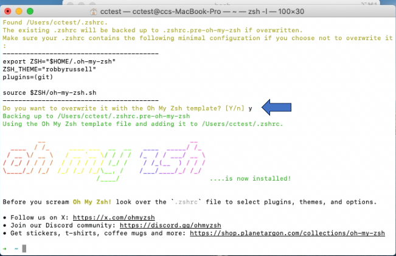

### change zsh theme  
When you install ohmyzsh, the theme is already download in this path  `~/.oh-my-zsh/themes/`

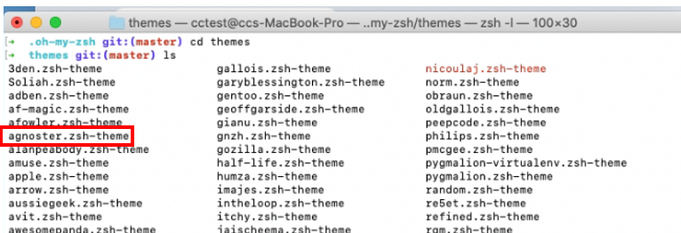

- theme description or other theme 
Please download theme [theme description](https://github.com/ohmyzsh/ohmyzsh/wiki/Themes)

For example change to agnoster theme [link](https://github.com/agnoster/agnoster-zsh-theme)   

- edit theme
please edit theme: `vim ~/.zshrc` and change to different theme name
```
ZSH_THEME='agnoster' # default use robbyrussell change to agnoster
exec $SHELL
```
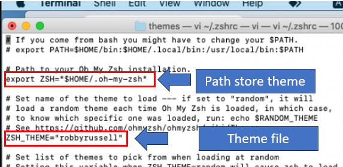

Now when you activate the theme it will look like below really ugly, you need to install font to fix this problem. 
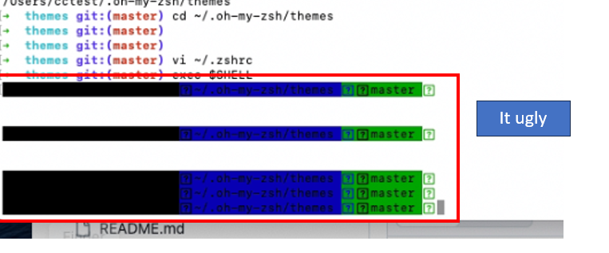


## Font
You can use 
- Nerd font: developers today use Nerd Fonts
- Powerline fonts: are older


### nerd font
- install nerd font
```
brew install --cask font-meslo-lg-nerd-font
```

If you like other nerd font you can search with this command that perfer you:
```
brew search nerd
```

why choose `font-meslo-lg-nerd-font`: 
> - It’s recommended + tested with Powerlevel10k.
> - It has all needed icons.
> - It’s clean, readable, and safe (no weird spacing issues).

## iterm2 terminal
You will have realize the font look ugly, so we need to install iterm2 therminal to fix this problem


### install iterm2
you can [download](https://iterm2.com/downloads.html) iterm2 and install manual, or with below command which download and install:
```
brew install --cask iterm2    
```
#### font 
Set this font in iTerm2 → Preferences → Profiles → Text → Change Font -> select MesloLGS Nerd Font Mono

Now after chnage it, ther iterm2 terminal look perfect right
[item2 change font ](img/iterm2_text.PNG)

#### Terminal Type
Default I think is xterm-256color if not change it: 
Preferences → Profiles → Terminal → Report Terminal Type → xterm-256color

#### Color setting
The color recommend **iTerm 2 + Solarized Dark**, but I will show how to change color theme. 

You can download iterm2 color or copy the code with below link:
> - iterm2 color plugin [download](https://github.com/mbadolato/iTerm2-Color-Schemes)
> - iterm2 [color format](https://iterm2colorschemes.com/)

You can use two method, one download file, or copy the code and create file

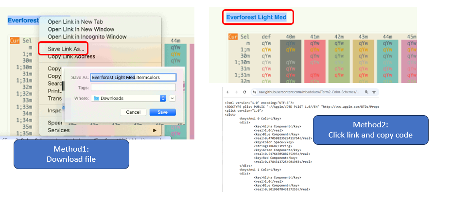

**(method1) import color plugin**
> Step1: Navigate to below path
>> Path: iterm →  preference →  profiles →  colors →  Color Presets → import

> Step2: import you download color plugin 
> Step3: choose the color you import just now

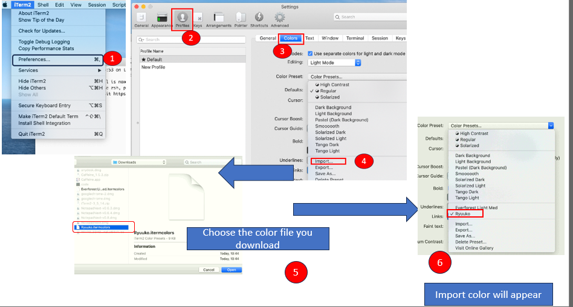

**(method2)** create file by copy url code and paste into file
```
go to https://iterm2colorschemes.com/ and select your best color format and copy or download
touch Ryuuko.itermcolors
vi Ryuuko.itermcolors1
paste in
item import the file you create
```

I Now after set the color let see the comparsion of the iterm2 color
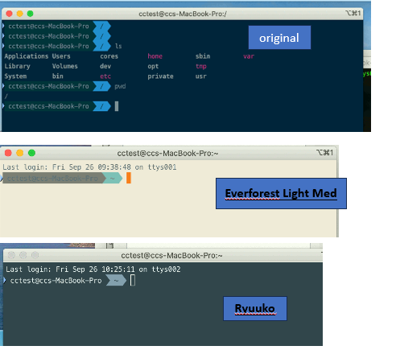

**Note:** When you download a color scheme from a site and import to use it, however you are not limited to that scheme's default settings. This mean if you use it and realize the color is great, then you want to change specfic color you aren't able to change it. 
 

## PowerLevel10K
Let install another powerful prompt theme if you think ohmyzsh is ok you can ignore it

You can see ohmyzsh theme doesn't look great enough let change to a more powerful one:
- 🚀 Focus: advanced features — icons, git status, Python/Node version, transient prompt, instant prompt, highly configurable.
- 🌟 Much more powerful, modern, and customizable.

[offical site](#https://github.com/romkatv/powerlevel10k)


### Install PowerLevel10K Theme for Oh My Zsh
```
git clone --depth=1 https://github.com/romkatv/powerlevel10k.git ${ZSH_CUSTOM:-$HOME/.oh-my-zsh/custom}/themes/powerlevel10k 
```

> Powerlevel10k location:
>> `~/.oh-my-zsh/custom/themes/powerlevel10k/powerlevel10k.zsh-theme`

### edit .zshrc and add powerlevel10k
- method1
vi .zshrc
```
ZSH_THEME="powerlevel10k/powerlevel10k"
```
- method2
```
echo 'source ~/powerlevel10k/powerlevel10k.zsh-theme' >>~/.zshrc
```

- activate your them : 

```
source ~/.zshrc
```

Note: you can use either method: 
> - reload shell: `source ~/.zshrc`
>> Reloads your `.zshrc` in the current shell session. Immediately applies the theme.

> - restart the shell: `exec $SHELL`
>> You can can also restart your shell: `exec $SHELL`


### configure setting

It will ask you question do this:
```
after set theme `.zshrc` it will ask you question, press 
Install Meslo Nerd Font? y
restart iterm2 or command+q 
Does this look like a diamond? y
Does this look like a lock? y
upward arrow: y
downward arrow: 1
does all these icons fit between the crosses? y
prompt style?3
1 unicode or 2 ascii? 1
Show current time? 2
prompt seperator?1
prompt head? 1
prompt tail: 1
prompt height: 2 
prompt collection? 3
prompt frame?4
connection & framme coloer? 1
prompt spacing?2
icons? 2
prompt flow: 1
enable transient prompt?n
Instant prompt mode? 1
apply?y
```
after chaning it if you use vscode you need to change some setting, I conver in the next section. 

### edit zshrc theme

- Edit `.zshrc` to change theme to powerlevel10k

> Method1: `vi ~/.zshrc`
```
ZSH_THEME="powerlevel10k/powerlevel10k"
```
> Method2: dump into `~/.zshrc`
```
echo 'source ~/powerlevel10k/powerlevel10k.zsh-theme' >>~/.zshrc
```

### Reload zshrc to activate

Reloads your `.zshrc` in the current shell session. Immediately applies the theme.
```
source ~/.zshrc 
```

Your terminal right now will change according to what you cofigure 

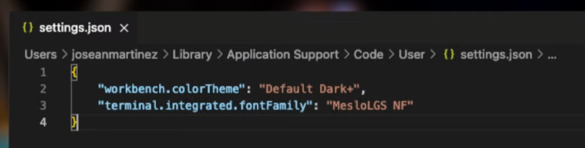

Note: Notice the duration on the right side you don’t see how long each command takes (execution time). Bt default Powerlevel10k only shows command execution time if the command takes longer than a threshold (usually 5 seconds).If you want to show you need to change the THRESHOLD to 0 which always show execution time:
```
#change to 0 second
typeset -g POWERLEVEL10K_COMMAND_EXECUTION_TIME_THRESHOLD=0

#reload 
source ~/.p10k.zsh
```

### Run Powerlevel10k configuration wizard
- run the Powerlevel10k configuration wizard
If you want to reconfigure Powerlevel10k configure setting then you can use this:
```
p10k configure
```

- reset completely:
```
rm ~/.p10k.zsh
```
After it restart your terminal it will run cofigure again. 

### summary
- this is the theme we set
```
ZSH_THEME="agnoster"
ZSH_THEME="random" #randome theme  
ZSH_THEME="powerlevel10k/powerlevel10k" 
```
- different Location strore them: 
> powerlevel10k: `powerlevel10k`
>> `~/.oh-my-zsh/custom/themes/powerlevel10k/powerlevel10k.zsh-theme`

> ohmyzsh: ex `agnoster`
>> ~/.oh-my-zsh/themes/agnoster.zsh-theme   

- How does it know ZSH_THEME to use
```
ZSH="$HOME/.oh-my-zsh"
ZSH_THEME="powerlevel10k/powerlevel10k"   # or "agnoster"

#default 
ZSH_CUSTOM=${ZSH_CUSTOM:-$ZSH/custom}

if [ -f "$ZSH_CUSTOM/themes/$ZSH_THEME.zsh-theme" ]; then
  source "$ZSH_CUSTOM/themes/$ZSH_THEME.zsh-theme"
elif [ -f "$ZSH/themes/$ZSH_THEME.zsh-theme" ]; then
  source "$ZSH/themes/$ZSH_THEME.zsh-theme"
fi
```

## Update font on terminal and vscode

### Update Terminal app Font(Optional)
Since you have set everything, You will realzie your mac terminal will look strange, please also set the font
You can also change terminal app to this font, else it will look ugly.  If you don't need it in future then you can ignore this 

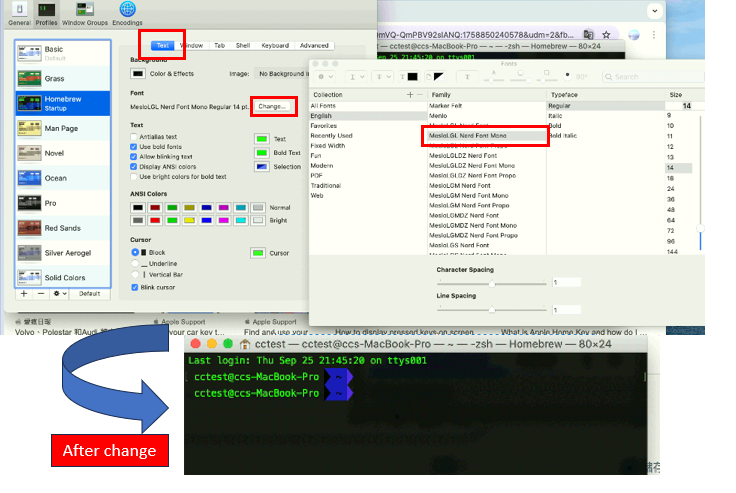

### Update VSCode Terminal Font (Optional) 
If you change you font in terminal you also need to change in vscode, please go to `setting.json` and update the font name
```
"terminal.integrated.fontFamily": "MesloLGS NF"
```
please reder below picture to see before and after chaging 
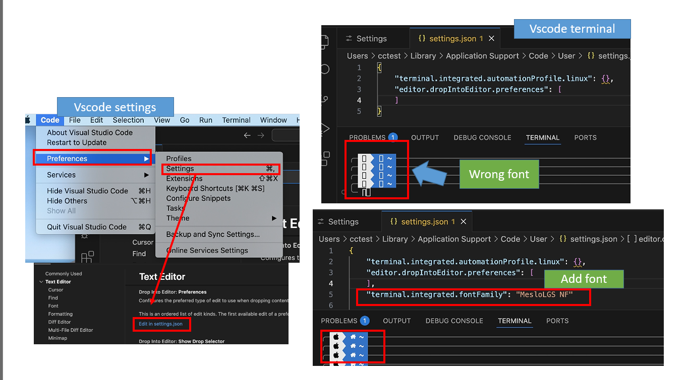

## plugin 
Everything have been setup, let add some great plugin which will make you more productive while using the terminal. 
**How to add plugin:**

- Step 1: Search for plugin name 
You can refer to this link for different plugin [offical site](# https://ohmyz.sh/) [github plugin](#https://github.com/ohmyzsh/ohmyzsh/wiki/Plugins)
- Step 2: Download plugin
- Step 3: Add your plugin into `~.zshrc`
 Copy the name of the plugin you want from above web and paste it into `plugins=()` like below 
 
```
plugins= (git) 
```

default git is been added `plugins= (git)`, after added, 

- Step4: reload `.zshrc`
```
source ~.zshrc
```

### Auto Suggestions
It will recognize the command you run in the past something, and while typing command it will give you suggestion according to previous command you use to run. 

In short it watches your typing and suggests commands based on history.

- Download autosuggestions plugin
```
git clone https://github.com/zsh-users/zsh-autosuggestions ${ZSH_CUSTOM:-~/.oh-my-zsh/custom}/plugins/zsh-autosuggestions
```
- add plugin to `~/.zshrc`
```
plugins=(git zsh-autosuggestions)
```
- reload `.zshrc`

- How to use
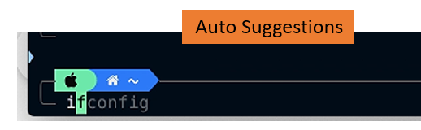

I use to run `ifconfig`, after activate this plugin when i press `i` it will auto suggest `ifconfig`

### Syntax Highlighting
This allow to check command is valid or not, if you type cdx it will highlight red because it invalid command, cd will be green, which is valid command. 

-  download Syntax Highlighting
```
git clone https://github.com/zsh-users/zsh-syntax-highlighting.git \
  ${ZSH_CUSTOM:-~/.oh-my-zsh/custom}/plugins/zsh-syntax-highlighting
```
- add plugin to `~/.zshrc`
```
plugins=(git zsh-autosuggestions zsh-syntax-highlighting)
```
- reload `.zshrc`

- How to use:

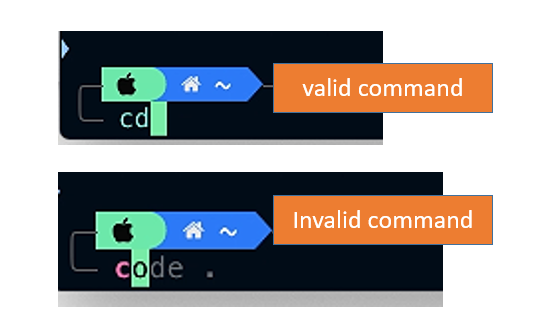

Notice when I type `code` it higlight red meaning it's invalid command, and `cd` highlight green which is valiad comamnd. 


### zsh-z: directory jumping
Keeps a history of directories you cd into, next time, you can jump back there just by typing part of the name.

For example: `cd ~/projects/github/XXX` next time you type `z github` instead of full path it will recognize. 

- install 
```
git clone https://github.com/agkozak/zsh-z.git ${ZSH_CUSTOM:-~/.oh-my-zsh/custom}/plugins/zsh-z
```
- add plugin to `~/.zshrc`
```
plugins=(git zsh-autosuggestions zsh-syntax-highlighting zsh-z)
```
- reload `.zshrc`

- how to use
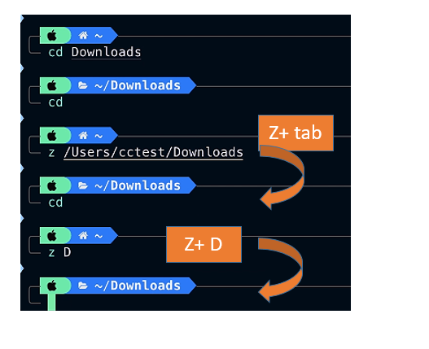

I type `cd Download` it recognize the directory, cd back to home directory, and press `z + tab` or `z+D` it will go to cd Download directory. It recognize the history folder. 


### fzf: fuzzy searching anything (skip)
It lets you quickly search files, history, git branches, processes, etc.


- install fzf 
```
git clone --depth 1 https://github.com/junegunn/fzf.git ~/.fzf
~/.fzf/install
```
- add plugin to `~/.zshrc`
```
plugins=(git zsh-autosuggestions zsh-syntax-highlighting zsh-z fzf)
```

- reload `~/.zshrc`

- How to use:
```
# Search command history
Ctrl+R

# Search files in current dir
Ctrl+T

# Files under the current directory
# - You can select multiple items with TAB key
vim **<TAB>

# Files under parent directory
vim ../**<TAB>

# Files under parent directory that match `fzf`
vim ../fzf**<TAB>

# Files under your home directory
vim ~/**<TAB>


# Directories under current directory (single-selection)
cd **<TAB>

# Directories under ~/github that match `fzf`
cd ~/github/fzf**<TAB>
```

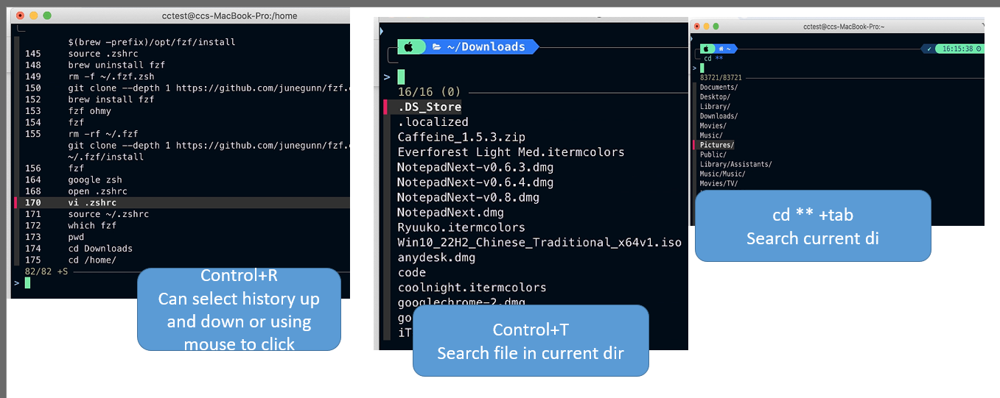

### web-search
look thing up with browser

- add plugin to `~/.zshrc`
```
plugins=(git zsh-autosuggestions zsh-syntax-highlighting zsh-z fzf web-search)
```

- reload `.zshrc`

- How to use
Just type in `google zsh` it will navigate to google and search zsh

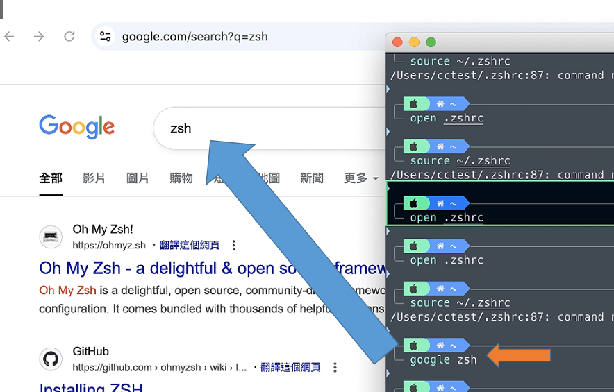


### Shorten or hidden username@hostname

- add this line below of `ZSH_THEME` in `.zshrc` file
```
DEFAULT_USER=$USER
```
- reload `.zshrc`

## reference
- https://www.youtube.com/watch?v=CF1tMjvHDRA&t=10s
- https://medium.com/airfrance-klm/beautify-your-iterm2-and-prompt-40f148761a49
- https://medium.com/nitas-learning-journey/mac%E7%B5%82%E7%AB%AF%E6%A9%9F-terminal-%E8%A8%AD%E5%AE%9A-iterm2-ba63efd0df6a- https://medium.com/nitas-learning-journey/mac%E7%B5%82%E7%AB%AF%E6%A9%9F-terminal-%E8%A8%AD%E5%AE%9A-iterm2-ba63efd0df6a
- https://github.com/josean-dev/dev-environment-files/tree/oh-my-zsh-zshrc-config
- https://jumping-code.com/2024/04/30/mac-terminal-settings/
- https://medium.com/statementdog-engineering/prettify-your-zsh-command-line-prompt-3ca2acc967f
- https://medium.com/@imaginechiu/%E8%BB%9F%E9%AB%94%E5%B7%A5%E7%A8%8B%E5%B8%ABmackbook-terminal-%E8%A8%AD%E5%AE%9A-7228ac083584
- https://pjchender.dev/app/mac-terminal-iterm2/
- https://github.com/imagine10255/mac-terminal-helper/tree/master
- https://medium.com/nitas-learning-journey/mac%E7%B5%82%E7%AB%AF%E6%A9%9F-terminal-%E8%A8%AD%E5%AE%9A-iterm2-ba63efd0df6a
- https://wshs0713.github.io/posts/8078f16/
- https://holychung.medium.com/%E5%88%86%E4%BA%AB-oh-my-zsh-powerlevel10k-%E5%BF%AB%E9%80%9F%E6%89%93%E9%80%A0%E5%A5%BD%E7%9C%8B%E5%A5%BD%E7%94%A8%E7%9A%84-command-line-%E7%92%B0%E5%A2%83-f66846117921
- https://www.kwchang0831.dev/dev-env/ubuntu/oh-my-zsh
