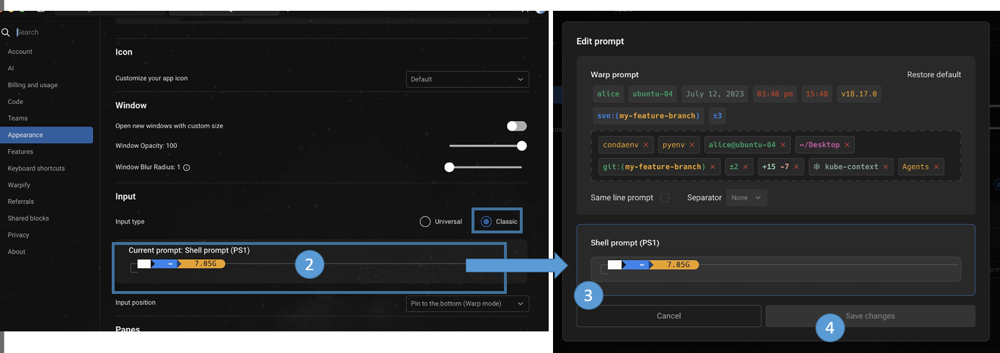
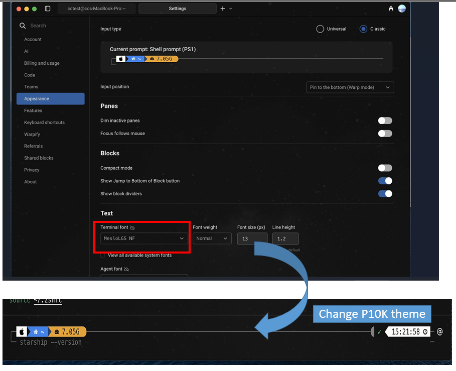
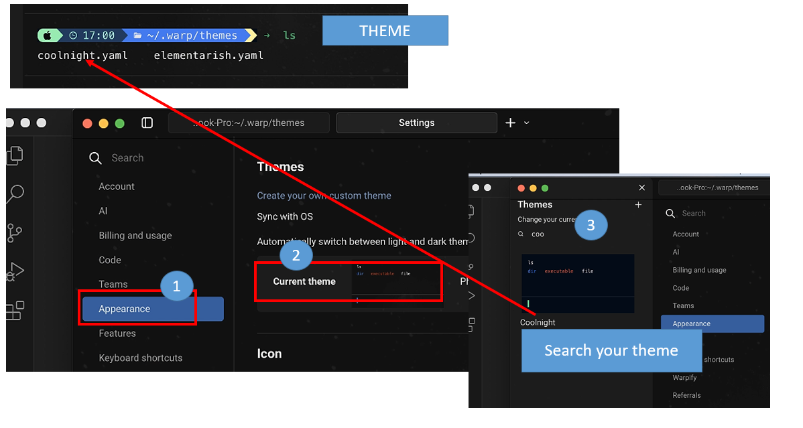

# Setup startship prompt 

In this note, I am going to share how to setup startship prompt using warp terminal, you don't have to use wrap, you can also use iterm2 + starship. 

- **Warp Terminal**: This is a fast, modern terminal application built in Rust and Swift, known for its AI command features and block-based interface.
- **Starship Prompt**: A minimal, blazing-fast, and infinitely customizable prompt. Starship's major advantage is that it is cross-shell (works with Bash, Zsh, Fish, PowerShell, etc.).
- **Other prompt**:  `OhMyZsh` (a configuration framework) and `Powerlevel10k` (a theme) are built specifically for the `Zsh` shell.

Overall, Many people recommend `Starship` is better than `P10k`, and `Warp` is better than `Iterm2`. 

**Note**: My environment uses the `ohmyzsh+P10k setting`, so I already install the nerd font. In this note, you no need to install `P10K` or `ohmyzsh`. 


You can refer to link below for Starship documentation: 
- https://starship.rs/
- https://starship.rs/config/#conditional-format-strings


## File Name

I have create serveral configure for reference, mac hidden file are hide, please use `control + shift+ .` to show up. 
- `.zshrc` file: In case ig you want to use different terminal + prompt I add for you:
	- `.zshrc`: only contain starship configure+ warp fixed
	- `.zhrc_warp_iterm`: detected terminal warp or item2, allow to use P10K+ starship
	- `.zhrc_multiple_terminal`: detected Terminal like warp, iterms or other Terminal 
- `themename.yaml`: warp theme cofigure
	- `elementarish.yaml` (**source**:[warp](https://github.com/warpdotdev/themes.git)
	- `coolnight.yaml` (**source** [theRubberDuckuiee](https://github.com/theRubberDuckiee/dev-environment-files) )  
- `starship.toml`: starship cfg (**source** reference:[theRubberDuckuiee](https://github.com/theRubberDuckiee/dev-environment-files) )  

If you want to use `zshrc`, please use copy `.zhrc_warp_iterm` `.zshrc`


## Setup Warp and StarShip 

### Step1: Download and install

You can refer Starship [Download setting](https://starship.rs/guide/#%F0%9F%9A%80-installation)

Please refer to the installation command below either one:
- MAC OS/Linux
```
curl -sS https://starship.rs/install.sh | sh
```
- MAC OS with homebrew
```
brew install starship
```

- Window: 
```
#Chocolatey
choco install starship

#winget	
winget install --id Starship.Starship

#Scoop	
scoop install starship
```

### Step2: zshrc cofigure

- edit `.zshrc` and add line below to the last line
```
eval "$(starship init zsh)"
```
### Step3: warp setting prompt
- Warp set Shell prompt (PS1)

Please change it in this location below:
> **Path Location**
>> `Settings > Appearance > Input > Classic >` click `Shell Prompt (PS)`, like below



After set it move back to the warp terminal it will look strange. We need to change the font:


- Change font to Nerd Font

You have to change to nerd font in my case is `Meslogs NF` and it will look like P10K theme

Please change it in this location below:
> Path Location
>> `Settings > Appearance > Text` change to `Meslogs NF`


In case your environment doesn't have this font, please download and install by command below, alternative can refer download link [nerd font](https://www.nerdfonts.com)
```
brew install --cask font-meslo-lg-nerd-font
```

### Step4 Starship configure add to zshrc

We want to use `Starship` configure, not using `P10K`, so you need to create a `starship` configure file:

- create a starship configuration
It will create the `starship.toml` configuration file, you can refer to this [link](#https://starship.rs/config/)
```
mkdir -p ~/.config && touch ~/.config/starship.toml
```
- edit `starship.toml` for customization of the prompt:

```
vi ~/.config/starship.toml
```

You can reference [theRubberDuckuiee](https://github.com/theRubberDuckiee/dev-environment-files/blob/main/starship.toml) prompt configure

This page also explains designing the [preset setting](https://starship.rs/presets/)

### Step5 add starship location into zshrc
- edit zshrc.sh
If you ever configured `ohmyzsh` or `P10K`, please comment `P10K` like below:
```
#ZSH_THEME="agnoster"
#ZSH_THEME="powerlevel10k/powerlevel10k"
```
Since you want to use Starship Prompt, you won't need ohmyzsh likethe  above line., Just use below is ok
```
export STARSHIP_CONFIG=~/.config/starship.toml
eval "$(starship init zsh)"
```

After setting it reload you zsh (optional)
```
source ~.zshrc.sh
```
### Step6: Wrap customized theme

You can refer to this [link customize theme](https://docs.warp.dev/terminal/appearance/custom-themes)

- create warp theme directory
This is store your warp theme page
```
mkdir -p $HOME/.warp/themes/
cd $HOME/.warp/themes/
```
- clone warp theme (not a great idea)
```
git clone https://github.com/warpdotdev/themes.git
cd stradicat/elementarish.yaml
mv elementarish.yaml ../
#remove everything except elementarish.yaml
find . -maxdepth 1 ! -name "elementarish.yaml" ! -name "." -exec rm -rf {} +
```
- Create your theme
edit your theme: `vi $HOME/.warp/themes/coolnight.yaml`

- load your theme

> **Path Location**
>> `Settings > Appearance > current theme` and type `co` on theme it will search related theme and show up.




## Summary

Let quick summary on setting it, in above it might be a lot of stuff, because my envirnoment might contain P10K.

### StarShip configure

> You can refer to this link for more detailed documentation: 
>> - [github](https://github.com/starship/starship)
>> - [offical site](https://starship.rs/config/)
>> - [preset](https://starship.rs/presets/nerd-font)
>> - [prompt cfg](https://starship.rs/config/)
- Create a startship configure
```
mkdir -p ~/.config && touch ~/.config/starship.toml
```

- Modify your starship prompt, then use the below 
```
~/.config/starship.toml
```
Please refer to this link for how to set the [prompt theme ](https://starship.rs/config/)

#### Customize prompt setup
Please refer more detail for [starship configure documentaion](https://starship.rs/config/#conditional-format-strings)

You can refer [link dotfiles](https://github.com/hendrikmi/dotfiles/blob/3cf2c969323e1f33255743b04d9d7750cfee7496/starship/starship.toml)
```
format = """
$directory\
$git_branch\
$git_status\
$fill\
$python\
$nodejs\
$haskell\
$package\
$aws\
$docker_context\
$jobs\
$cmd_duration\
$line_break\
$character"""
add_newline = true
palette = 'nord'

[directory.substitutions]
'Documents' = '󰈙'
'Downloads' = ' '
'Music' = ' '
'Pictures' = ' '

[git_branch]
style = 'fg:green'
symbol = ' '
format = '[on](white) [$symbol$branch ]($style)'

[git_status]
style = 'fg:green'
format = '([$all_status$ahead_behind]($style) )'

[fill]
symbol = ' '

[python]
style = 'teal'
symbol = ' '
format = '[${symbol}${pyenv_prefix}(${version} )(\($virtualenv\) )]($style)'
pyenv_version_name = true
pyenv_prefix = 


```

### Modify zshrc file
add your starship cfg into `zshrc.sh`

```
export STARSHIP_CONFIG=~/.config/starship.toml
eval "$(starship init zsh)"
```
### Warp theme configure (optional)

> You can refer to these link for more detail documentation: 
>> - [github](https://github.com/warpdotdev/themes.git)
>> - [offical site](https://docs.warp.dev/terminal/appearance/custom-themes)


- add or modify your own warp theme

```
#create warp theme directory
mkdir -p $HOME/.warp/themes/
touch  $HOME/.warp/themes/themename.yaml
```


## Reference: 
- Jessica Wang:
	- YT: https://www.youtube.com/watch?v=Xyr_EOmEB_g
	- gitcfg: https://github.com/theRubberDuckiee/dev-environment-files
	- full command: https://dev.to/therubberduckiee/how-to-configure-starship-to-look-exactly-like-p10k-zsh-warp-h9h
- https://www.youtube.com/watch?v=v2S18Xf2PRo	
- https://www.adamdehaven.com/snippets/how-to-customize-your-shell-prompt-with-starship