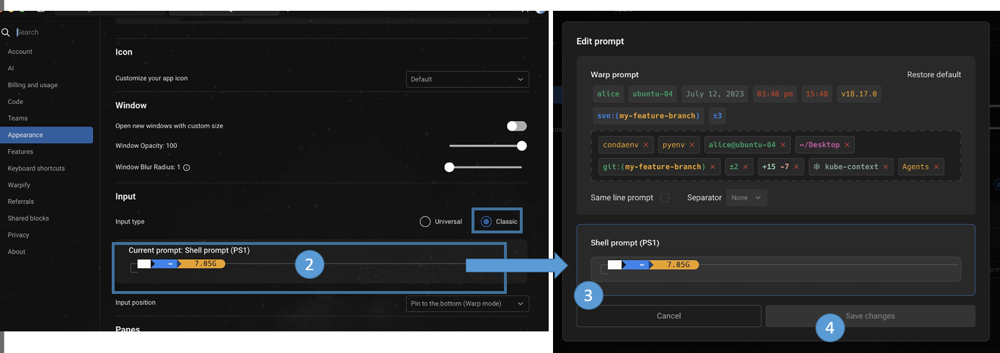
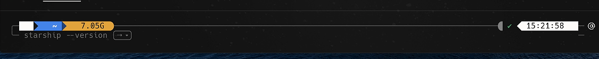
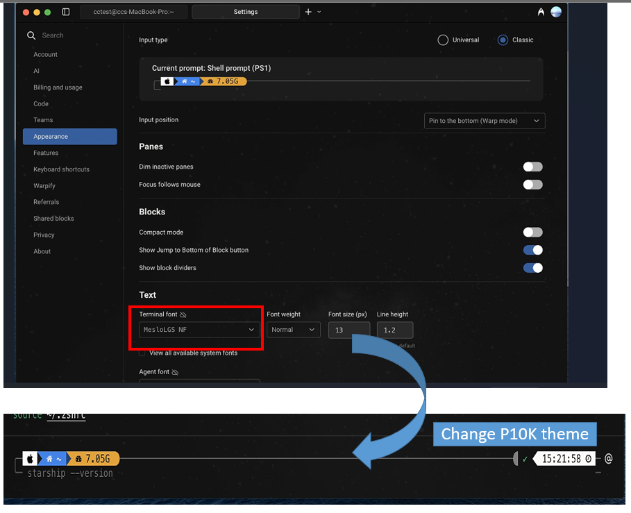

# Setup startship prompt 

In this note I am going to share how to setup startship prompt using warp terminal. 

- Warp Terminal: This is a fast, modern terminal application built in Rust and Swift, known for its AI command features and block-based interface.
- Starship Prompt: A minimal, blazing-fast, and infinitely customizable prompt. Starship's major advantage is that it is cross-shell (works with Bash, Zsh, Fish, PowerShell, etc.).
- Other prompt:  Oh My Zsh (a configuration framework) and Powerlevel10k (a theme) are built specifically for the Zsh shell. 

Overall Many people recommend starship is better than P10k, and wrap is better than Iterm2. You don't need OhmyZSH to use starship. 

**Note**: My envinroment use the ohmyzsh+P10k setting, so I already install the nerd font. In this note, you no need to install P10K or ohmyzsh. 


## Starship Setting

You can refer to below link for Starship documentation: 
- https://starship.rs/
- https://starship.rs/config/#conditional-format-strings


### Step1: Download and install

You can refer this page for [Download setting](https://starship.rs/guide/#%F0%9F%9A%80-installation)

Please refer below installation best fir you:
- MAC OS/Linux
```
curl -sS https://starship.rs/install.sh | sh
```
- MAC OS with homebrew
```
brew install starship
```

- Window: 
```
#Chocolatey
choco install starship

#winget	
winget install --id Starship.Starship

#Scoop	
scoop install starship
```

### Step2: zshrc cofigure

- edit `.zshrc` and add below line into last line
```
eval "$(starship init zsh)"
```
### Step3: wrap setting prompt
- Wrap set Shell prompt (PS1)

Please change it in this location below:
> Path Location
>> `Settings > Appearance > Input > Classic >` click on shell, will occur `Shell Prompt (PS)`, like below



After set it move back to wrap terminal it will look strange, we need to change font:


- Change font to nerd font

You have to change to nerd font in my case is `Meslogs NF` and it will look like P10K theme

Please change it in this location below:
> Path Location
>> `Settings > Appearance > Text` change to `Meslogs NF`



In case your envinroment don't have this font please install by below command or download [nerd font](https://www.nerdfonts.com)
```
brew install --cask font-meslo-lg-nerd-font
```


### Step4 starship configure add into zshrc

We want to use starship confgiure not using P10K, so you need to create a starship configure file:

- create starship configure
It will create the starship.toml file and edit it 
```
mkdir -p ~/.config && touch ~/.config/starship.toml
```
- edit starship.toml 

```
vi ~/.config/starship.toml
```

You can reference other people configure like:

> - [theRubberDuckuiee github](https://github.com/theRubberDuckiee/dev-environment-files/blob/main/starship.toml)


- edit zshrc.sh
If you ever install or congfigure P10K, please comment P10K and uncomment `ZSH_THEME` like:
```
ZSH_THEME="agnoster"
#ZSH_THEME="powerlevel10k/powerlevel10k"
```

please add your Starship cofngiure in the last line
```
export STARSHIP_CONFIG=~/.config/starship.toml
eval "$(starship init zsh)"
```

After setting it reload you zsh:
```
exec zsh
```
### Step5 Create your own theme

You can refer to this [link customize theme](https://docs.warp.dev/terminal/appearance/custom-themes)

- create wrap theme
```
mkdir -p $HOME/.warp/themes/
cd $HOME/.warp/themes/
```
- clone wrap theme (not a great idea)
```
git clone https://github.com/warpdotdev/themes.git
cd stradicat/elementarish.yaml
mv elementarish.yaml ../
#remove everything except elementarish.yaml
find . -maxdepth 1 ! -name "elementarish.yaml" ! -name "." -exec rm -rf {} +
```
- Create your theme
A better way is create your own `themes.yaml` file. This [Youtube Video](https://www.youtube.com/watch?v=v2S18Xf2PRo) show how to create your theme

edit your theme: `vi $HOME/.warp/themes/coolnight.yaml`

- load you theme

> Path Location
>> `Settings > Appearance > Text` change to `Meslogs NF`


## Reference: 
- Jessica Wang:
	- YT: https://www.youtube.com/watch?v=Xyr_EOmEB_g
	- gitcfg: https://github.com/theRubberDuckiee/dev-environment-files
	- full command: https://dev.to/therubberduckiee/how-to-configure-starship-to-look-exactly-like-p10k-zsh-warp-h9h
- https://www.youtube.com/watch?v=v2S18Xf2PRo	