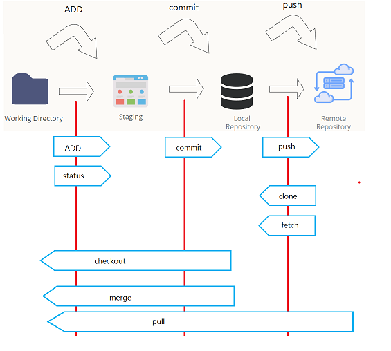

# GitHub related Note and Command

## Setup Envirnoment

working directory --- staging --- local repository ----- remote respository

#### Setup config File (`.gitconfig`)

- **`.gitconfig`** will store all your setting. After install git will generate it. 

- **Show your configure setting**: use command: `git config` and add `--list` parameter like this: 
  
  - `git config --list` will show all configure setting

- **edit your configuration** add username, and email address
  In order to publish any code we need to have username and email.

You can edit configure as below:

```
    $ git config --global user.name "username"
    $ git config --global user.email <email-address>
    $ git config --global color.ui auto
```

*Note: username and email don't have to be smae as github account* 

#### Create project init/Clone

Configuring user information, initializing and cloning repositories
Create working directory, there're two ways you can do:

> Create repository on github, and download the git
> or
> Create .git in local and push it up

| command   | description                                                   |
| --------- | ------------------------------------------------------------- |
| git init  | initialize an existing directory as a Git repository          |
| git clone | retrieve an entire repository from a hosted location via URLy |

**Example:**

please go to github and first create your repository project name

- Git init method:
  
  - Run command in local:  `git init`,to generate `.git` file
    
    ```
    #create project example: tutorial
    $ mkdir tutorial
    $ cd tutorial
    $ git init
    #will generate .init file
    $ touch test.txt
    ```
  
  - push into remote          
    
    ```
    $git remote add origin https://github.com/<username>/rrepository.git   
    $git push -u origin master 
    ```
    
    Noe you can go to `.git` direcrory and open `configure` to see is it bundle

- clone repository method:
  
  **Note:**  You can create file in guthub or upload file, and download it using `clone`. It will provide you `.git` file, you don't have to do git init.  
  
  Example:　`git clone https://github.com/<username>/rrepository.git`

#### Topology



#### Tool download

| Name        | url                               |
| ----------- | --------------------------------- |
| github bash | https://www.git-scm.com/downloads |
| sourcetree  | https://www.sourcetreeapp.com/    |

---

## Basic git command

### STAGE & SNAPSHOT

This are the basic command we often use: 

> $ git add myfile.txt
> $ git status
> $ git commit -m "first commit"
> $ git --log
> $ git push master #or origin


### 1. create a file in your folder

create a file `$touch test.txt`

### 2. Check git status

`$git status` # will occur **unstage**

### 3. Staging your file `git add <filename> or git add . `

- git add 
  There are couple of command you can use:
  
  > git add filename.xxx
  > 
  > git add .  #current directory. Stage new/modify/delete files or directory  
  > git add -A #Stage new/modify files or directory
  > git push -u origin main 
  
   **Example:** 
  
  ```
  git add .
  git status
  ```

- git reset [file] 
  unstage a file while retaining the changes in working directory

### 4. commit file to save in local repository

- commit your file using -m for message 
  `$ git commit -m "first commit"`
  or skip staging
  `$ git commit -am "first commit"`
- check log to see commit detail
  `git --log ` or `git --log oneline`

### 5. Update remote server

In this step it will push your file to github server
`$ git push master #or origin`

There're couples of command as below: 

- Push `git push <branch>`
- Pull  (get update branch) `git pull`
- Fetch 
- git clone (download git repository) `git clone https://xxxx.git`

### 6. Other command

- git diff
  
  - `git diff`: diff of what is changed but not staged
  - `git diff --staged`: diff of what is staged but not yet commited

- `git log`:　show all commits in the current branch’s history

- `git status`: show modified files in working directory, staged for your next commit
  
  ## Advance  Seting
  
  ### Branch

- show listing your branch: ` $git branch`

- Create branch: `$git branch <branch name>`

- Switch branch: 
  
  - create and switch branch: `$git checkout -b <branch>`
  - create branch only: `$git checkout <branch>`

- delete branch: ` $git branch -d <branch>`

- Merge branch: `$git merge <branch name>`

**Example:**
After Creating master need to push like this:

```
$git add -A 
#create draft branch
$git checkout draft
$git commit -m "adding github comamnd"
#push origin draft
$git push origin draft
```

### Conflict Branch

### Reset/ checkout/Fetch recover commit

### rebase:

- git -rebase:
  
  apply any commits of current branch ahead of specified one

# Reference:

- https://code.yidas.com/git-commands/
- https://www.maxlist.xyz/2020/05/03/git-reset-checkout/
- https://w3c.hexschool.com/git/fd426d5a
- https://june.monster/git-github-checkout-reset-revert/