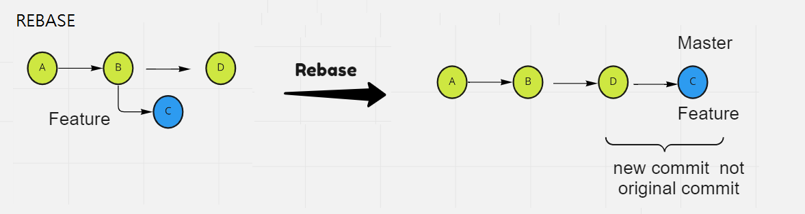

# GitHub related Note and Command

## Setup Environment

### Topology

working directory --- staging --- local repository ----- remote respository


### Tool download

| Name        | url                               |
| ----------- | --------------------------------- |
| github bash | https://www.git-scm.com/downloads |
| sourcetree  | https://www.sourcetreeapp.com/    |

### Setup config File (`.gitconfig`)

After install git it will generate `.gitconfig`  file, which store git configure setting . Store location:

> Windows：C:\Users\username\
> MacOs：~/.gitconfig

- **Show your configure setting**: use command: `git config` and add `--list` parameter like this: 
  
  - `git config --list` will show all configure setting

- **edit your config** add username, and email address
  In order to publish any code we need to have username and email.
  
   You can edit configure as below:    
  
  ```
  $ git config --global user.name "username"
  $ git config --global user.email <email-address>
  $ git config --global color.ui auto
  #add specific editor
  #git config --global core.editor emacs
  #git config --global core.editor "nano -w"
  ```

- Alias Git command 
  
  ```
  $git config --global alias.co checkout
  $ git config --global alias.br branch
  $ git config --global alias.st status
  $ git config --global alias.ci commit
  #show log oneline with graph 
  $ git config --global alias.og log --oneline --graph
  ```

## Basic git command

Basic Step and common step are as below:

```
＃Step1: git init 
＃Step 2: touch file and edit file
#Step3: git add .
#Step4: git commit -m "message to commit"
#Step5: git push 
```

### git Init

This initializes a git repository, and creates the initial .git directory in a new or already existing project

> Create `.git init` in local and push to remote repository 

- Run command in local: `git init`,to generate `.git` file. Step as below: 

```
  #create project example: tutorial
  $ mkdir <directoryName>
  $ cd <directoryName>
  #inital git will generate .git
  $ git init
```

### git status

**Syntax**: `git status` , show status of new file is added or modify. If new file is been modify will occur `Untracked files`

> git status

### git add: Staging your file

This will add file changes that are in your working directory to your index

**Syntax**: `git add <filename>` ,  you can use below command: 

> git add  <filename>
> git add .  #current directory. Stage new/modify/delete files or directory  
> git add -A #Stage new/modify files or directory

    Example Step:    

```
    #create a file 
    $ touch test.txt
    # will show git status will occur unstage
    $ git status
    # adding file into staging 
    $ git add . 
    $ git status will occur stage
```

### git commit: save in local repository

This Git command takes all of the changes written in the index, creates a new commit object pointing to it, and sets the branch to point to that new commit. You can use these command: 

- commit your file using -m for message 
  `$ git commit -m "first commit"`

- or skip staging
  `$ git commit -am "first commit"`

### git log : show commit history detail

This command will show a list of commit history and commit ID, and include the corresponding details. You can restore with the commit ID, bu checking `git log` command. You can use below command: 

- check log to see commit history  detail or check commit id 
  
  > `git log` 

- show in one line
  
  > `git log --oneline`  #show all commit history 
  > 
  > `git log --oneline --n` #n mean show latest commit 

- --graph 
  
  > git log --oneline --graph

### git push: push into remote repository

This Git command will push all the modified local objects to the remote repository(github). 

- push new repository to remote(first time)
  
  ```
  $git remote add origin https://github.com/<username>/test.git   
  git branch -M main
  git push -u origin main 
  ```
  
  To understand `git remote`, please refer below `git remote` for more information. 

- push your repository remotely 
  
  > $git push <remote_name> 
  > 
  > $git push -u origin master 
  
     or
  
  > $git push 

`-u` : will use default master or main branch. It will use the last push default branch. So if you use `git push` next time, your can just use command like this: `git push` without adding branch name. 

`origin` : github use default branch `orgiin`, you can change also change to other name if you like. 

### git clone : download  repository from remote

 You can use git clone to download repository from remote to local. This command creates a Git repository copy from a remote source.

> Syntax: `git clone https://github.com/<username>/repository.git`

you can also use to duplicate anither repository 

**Example:**

- `git clone https://github.com/<username>/test1.git` orginal repository test1

- `git clone https://github.com/<username>/test1.git test2` duplicate rep test2

### git remote: multiply remote repository

We need to link our local repoistory to remote repoistory, we need to register by using this comamnd: `$git remote add origin　<remote repoistory url>`

You can check `.git\config` to see link success or not, if success will occur as below: 

```
[remote "origin"]
url = https://github.com/<username>/test.git 
```

We can use the same local repository with multiply  remote repository in github.  

For example I have `test` in <u>remote repository(github)</u>, let create another <u>new remote repository</u> as `test2` and use the same <u>local repository</u>. 


**Example:**

1. Go to github create new repository name `test1`

2. run  **remote add origin** will have error 
   
   - `git remote add origin https://github.com/chenchih/test1.git` It will occur error: `error: remote origin already exists.` 
   
   - Since we have already create `origin` already, so we need to change different remote repository name. 

3. change **remote add origin** into **remote add git2**
   
   `git remote add git2 git@github.com:chenchih/test1.git`

4. push to server again
   
   > git push -u *git2* main

Why yould I want to do like this, a local repository link to two different remote repoistory? You can think one is `code release server` another one is testing code server.

### Other command

- git diff
  
  - `git diff`: diff of what is changed but not staged
  
  - `git diff --staged`: diff of what is staged but not yet commited

- git rm :  This will remove files from your index and your working directory so they will not be tracked.

## Advance  Setting

### Restore -reset soft and hard

If you wants to restore your file or commit, you have to use the `--reset` parameter. 

Syntax:  

git reset <commit id>
git reset <filename>

- git clean(before stage): same as delete file.
  
  This command is only when you create file in local directory and you create many files or fdirectory , you can use git clean to delete all folder. 
  
  > git clean -n #cehck which file will be delete
  > 
  > git clean -f #force to delete

- reset use when commit : There are three type of reset: **hard, soft and mixed**.  We will often use this method to reset to previous commit
  
  - Recover **after staging**: use this command: 
    
    > `git --rest HEAD` #go back to unstage
    > 
    > `git checkout --filename.txt`#restore to orginal file 
  
  - Recover **after commit**, you can use these command 
    
    > git reset --hard HEAD~n #
    > 
    > git reset --soft HEAD~n
    > 
    > git reset  #default is mixed
  
  Note: n mean reset last commit from head, or you can use ^ is the same
  
  - reset some command
    
    > git reset <commit id>
    > git reset <filename>
  
  

- discard change: 
  
  When you commit a file then you refuse to commit, maybe type wrong commit message. You can discard commit using this command:　
  
      git --reset --<filename> #will go back to no stage
      git checkout --<filename> #head will move backward

### Branch

- listing your branch:
  
  - show local branch: ` $git branch`
  
  - show remote branch: `$git branch -r`
  
  - show all branch remote and local:　`$git branch -a`

- Create branch　
  
  There are two command you can use, `checkout`, and `switch` (new command)
  
  > `checkout`: 
  
  - create new branch:　`$git branch <branch name>`
  
  - switch branch:　$git checkout 
  
  - create and switch branch: `$git checkout -b <branch>`
  
  - create exist branch: `git branch -f <branch name> <commit id>`
    
    ```
    #example:
    $ git branch -f tmp 9f9e1ba    
    $ git log tmp --oneline
    ```
  
  - git checkout = git switch +git restore
  
  > `switch`:
  
  This is a new command which is like `checkout = switch + restore`, it split the two function. 
  
  - switch branch:　`$git switch <branch name>`
  
  - create and switch branch: `$git switch -b <branch>` , `c`, is create
  
  - switch branch using `-` record previous branch: `git switch -`

- delete branch:  
  
  - delete local branch: `$git branch -d <branchname>` 
  
  - delete remote branch:　`git push <remote> --delete <branchname>` or shorter way ` git push <remote> :<branch>`
    
    -  `-d` option will delete the branch only if it has already been pushed and merged with the remote branch. 
    
    -  `-D` instead if you want to force the branch to be deleted, even if it hasn't been pushed or merged yet.
  
  - prume command to synch remote and lcoal
    
    `git fetch origin --prume`
  
  **Example:**  After Creating master need to push like this:    
  
  ```
  $git add .
  #create draft branch
  $git checkout draft
  $git commit -m "adding github comamnd"
  #push origin draft
  $git push origin draft
  ```

### Merge, Rebase, and squash

After knowing how to create branch it's time to know how to merge branches. Therere many type of merging, there are merge with Fast forward, merge with no fastforward and Rebase. Default merge uses FF command which is `git merge <branchname>` is equivalent to` git merge <branch> --FF`

> git merge <branch name> #which is fast forward
> 
> git merge <branchname> --no-ff
> 
> git rebase <branchname>
> 
> git squash <branchname>

- Merge
  
  - Fast Forward : linear merge
    
        
  
  - Non Fordward : recursive merge
    
    
  
  - not support using merge FF
    
    

- rebase: linear merge      
     

- Squash    
  
     

### Fetch/Pull

Fetch: donwload to remote repository 

Pull: Fetch+merge, which will update to your local file. 

### Tag

## reflog

This is really uuseful for restoring deleted branches and commits

- `git reflog` to check all commit log 

- `git reset <commitid>`  to restore your commit

## Reference:

- https://code.yidas.com/git-commands/
- https://www.maxlist.xyz/2020/05/03/git-reset-checkout/
- https://w3c.hexschool.com/git/fd426d5a
- https://june.monster/git-github-checkout-reset-revert/
- https://tzuhui.github.io/2019/06/20/Git/fast-forward/
- https://iter01.com/597403.html
